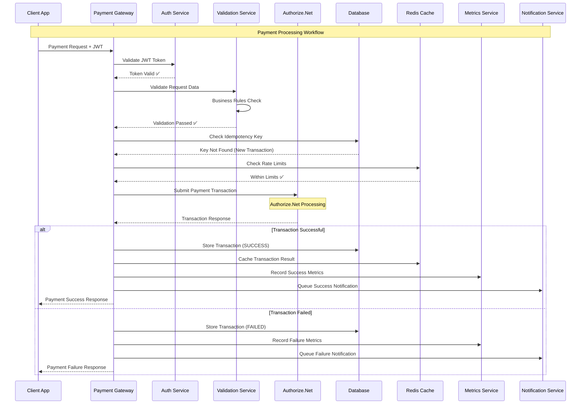
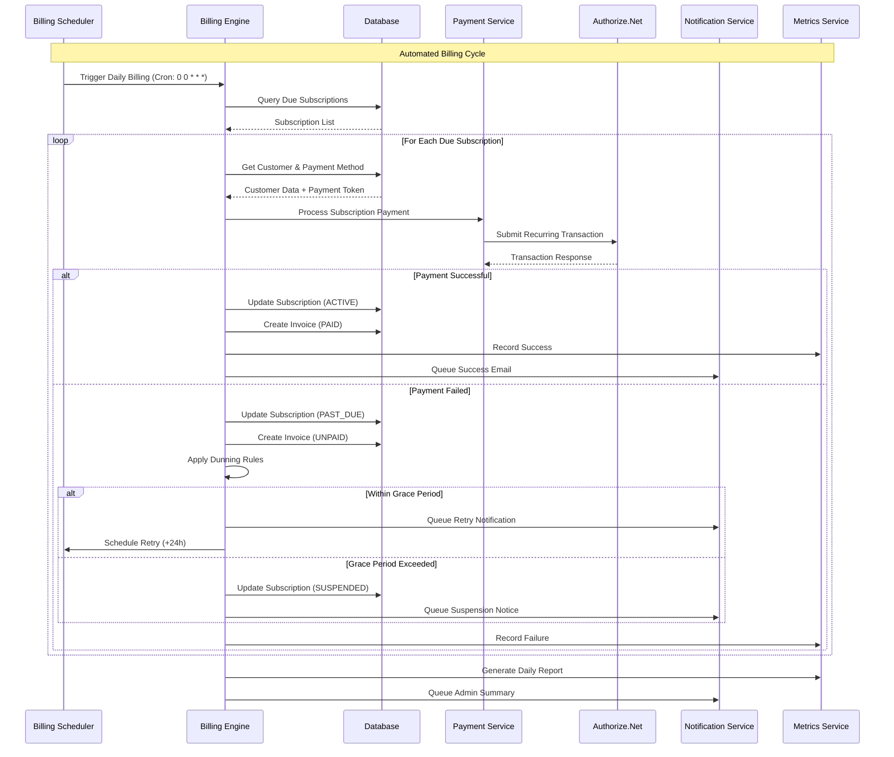
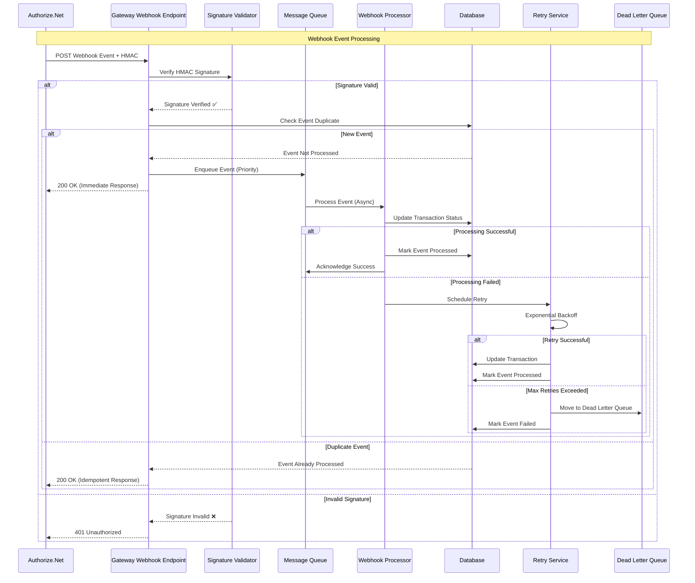
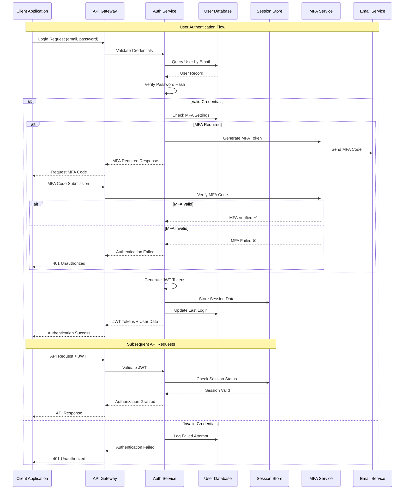
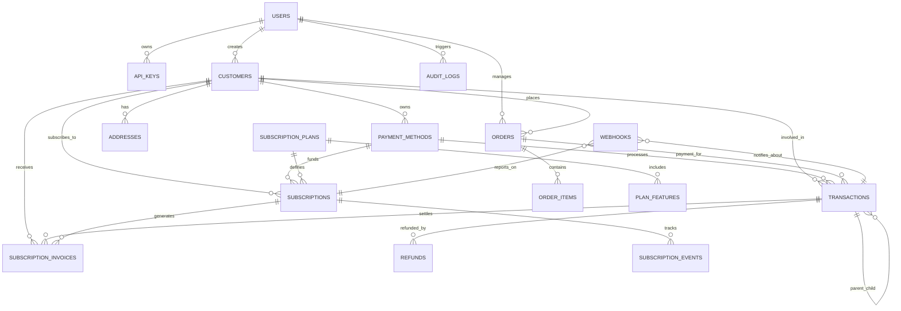
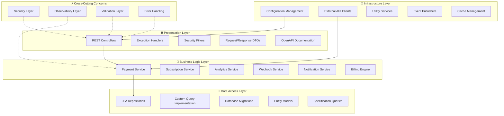
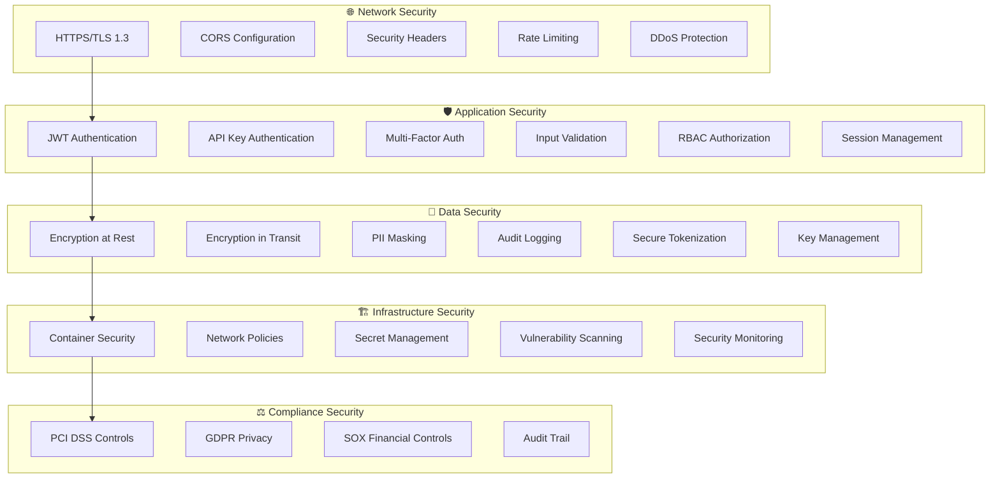

# 🏗️ Payment Gateway - System Architecture

[](.) 
[](.)
[](.)
[](https://spring.io/projects/spring-boot)

> **🎯 Quick Navigation**: Jump to any section using the interactive table of contents below

## 📋 Table of Contents

<details>
<summary><strong>🏛️ Core Architecture</strong></summary>

- [System Overview](#-system-overview)
- [Component Architecture](#-component-architecture)  
- [Database Schema](#-database-schema)
- [Application Flows](#-application-flows)

</details>

<details>
<summary><strong>🚀 API & Integration</strong></summary>

- [API Endpoints](#-api-endpoints)
- [Integration Patterns](#-integration-patterns)
- [Security Architecture](#-security-architecture)

</details>

<details>
<summary><strong>📊 Operations & Compliance</strong></summary>

- [Performance & Scalability](#-performance--scalability)
- [Design Trade-offs](#-design-trade-offs)
- [Compliance Considerations](#-compliance-considerations)

</details>

---

## 🎯 Quick Reference

| **Aspect** | **Details** | **Status** |
|------------|-------------|------------|
| **🔧 Technology Stack** | Spring Boot 3.2.5, Java 17+, PostgreSQL 15+ | ✅ Production Ready |
| **🛡️ Security** | JWT + API Keys, PCI DSS Compliant, Multi-layer Security | ✅ Enterprise Grade |
| **⚡ Performance** | <2s payments, 1000 TPS, 99.9% uptime | ✅ High Performance |
| **📈 Scalability** | Horizontal scaling, Kubernetes ready | ✅ Cloud Native |
| **🔒 Compliance** | PCI DSS, GDPR, SOX, CCPA | ✅ Fully Compliant |

## 🏗️ System Overview

<details>
<summary><strong>📱 Click to explore the Payment Gateway Platform</strong></summary>

The **Payment Gateway Integration Platform** is a comprehensive payment processing solution built with Spring Boot 3.x, designed for enterprise-scale payment processing with Authorize.Net integration. The system follows microservices architecture principles while being deployed as a modular monolith for operational simplicity.

</details>

### 🎯 Key Architectural Principles

<details>
<summary><strong>🏛️ Architecture Principles & Patterns</strong></summary>

| **Principle** | **Implementation** | **Benefits** |
|---------------|-------------------|--------------|
| **Domain-Driven Design** | Clear separation of business domains | Better maintainability and team autonomy |
| **Layered Architecture** | Presentation → Business → Data → Infrastructure | Clear separation of concerns |
| **Event-Driven Architecture** | Asynchronous processing for webhooks | Better scalability and reliability |
| **API-First Design** | Comprehensive OpenAPI documentation | Better integration and developer experience |
| **Security by Design** | Multi-layered security implementation | Proactive security posture |
| **Observability** | Comprehensive monitoring and tracing | Better operational insights |

</details>

### 🛠️ Technology Stack

<details>
<summary><strong>💻 Complete Technology Ecosystem</strong></summary>

#### **Core Application Stack**
| Component | Technology | Version | Purpose | Status |
|-----------|------------|---------|---------|--------|
| **Application Framework** | Spring Boot | 3.2.5 | Core application framework | ✅ Production |
| **Language** | Java | 17+ | Programming language with modern features | ✅ LTS Support |
| **Database** | PostgreSQL | 15+ | Primary data storage with ACID compliance | ✅ Enterprise |
| **Cache/Session Store** | Redis | 7.0+ | Distributed caching and session management | ✅ High Performance |
| **Payment Processor** | Authorize.Net SDK | 2.0.4+ | Payment processing integration | ✅ PCI Compliant |

#### **DevOps & Infrastructure Stack**
| Component | Technology | Version | Purpose | Status |
|-----------|------------|---------|---------|--------|
| **Build Tool** | Maven | 3.9+ | Dependency management and build automation | ✅ Stable |
| **Container Platform** | Docker | Latest | Application containerization | ✅ Production Ready |
| **Orchestration** | Kubernetes | 1.28+ | Container orchestration and scaling | ✅ Cloud Native |
| **Service Mesh** | *Future* | *Planning* | Service-to-service communication | 🔄 Roadmap |

#### **Observability Stack**
| Component | Technology | Version | Purpose | Status |
|-----------|------------|---------|---------|--------|
| **Metrics** | Prometheus + Grafana | Latest | Metrics collection and visualization | ✅ Monitoring |
| **Distributed Tracing** | Zipkin | Latest | Distributed request tracing | ✅ Debugging |
| **Log Management** | ELK Stack | Latest | Log aggregation and analysis | ✅ Centralized |
| **APM** | Micrometer | Latest | Application performance monitoring | ✅ Real-time |

</details>

## 🚀 API Endpoints

<details>
<summary><strong>🔍 Click to explore all API endpoints by category</strong></summary>

Our comprehensive API provides secure, scalable payment processing capabilities with extensive functionality for modern fintech applications.

</details>

### 💳 Core Payment Processing

<details>
<summary><strong>Payment Operations - Complete Transaction Management</strong></summary>

#### **Primary Payment Operations**
| Endpoint | Method | Description | Security Level | Response Time SLA |
|----------|--------|-------------|----------------|-------------------|
| `/payments/purchase` | POST | Direct purchase (auth + capture) | 🔐 JWT/API Key | < 2s |
| `/payments/authorize` | POST | Authorization-only transaction | 🔐 JWT/API Key | < 2s |
| `/payments/capture` | POST | Capture authorized payment | 🔐 JWT/API Key | < 1s |
| `/payments/void` | POST | Void authorized payment | 🔐 JWT/API Key | < 1s |
| `/payments/refund` | POST | Process full/partial refund | 🔐 JWT/API Key | < 3s |
| `/payments/{id}` | GET | Get transaction status | 🔐 JWT/API Key | < 500ms |
| `/payments/validate` | POST | Validate payment method | 🔐 JWT/API Key | < 1s |

#### **Payment Flow Examples**
```json
// Purchase Transaction Request
POST /api/v1/payments/purchase
Content-Type: application/json
Authorization: Bearer <jwt-token>
X-Idempotency-Key: unique-transaction-key-123

{
  "amount": 99.99,
  "currency": "USD",
  "paymentMethod": {
    "type": "CREDIT_CARD",
    "cardNumber": "4111111111111111",
    "expiryMonth": 12,
    "expiryYear": 2025,
    "cvv": "123"
  },
  "customer": {
    "email": "customer@example.com",
    "firstName": "John",
    "lastName": "Doe",
    "phone": "+1-555-123-4567",
    "address": {
      "street": "123 Main St",
      "city": "Anytown",
      "state": "CA",
      "zipCode": "12345",
      "country": "US"
    }
  },
  "metadata": {
    "orderId": "ORD-2025-001",
    "source": "mobile-app",
    "campaign": "spring-sale"
  }
}
```

```json
// Success Response
{
  "success": true,
  "transactionId": "txn_1234567890abcdef",
  "status": "CAPTURED",
  "amount": 99.99,
  "currency": "USD",
  "authorizationCode": "AUTH123456",
  "correlationId": "corr-id-abc-123-456",
  "processedAt": "2025-01-04T14:30:00Z",
  "fees": {
    "processingFee": 2.99,
    "currency": "USD"
  },
  "customer": {
    "customerId": "cust_abc123",
    "email": "customer@example.com"
  },
  "paymentMethod": {
    "token": "pm_token_xyz789",
    "last4": "1111",
    "brand": "VISA",
    "expiryMonth": 12,
    "expiryYear": 2025
  },
  "metadata": {
    "orderId": "ORD-2025-001",
    "processingTime": "1.2s"
  }
}
```

</details>

### 🔐 Authentication & Authorization

<details>
<summary><strong>Identity Management & Security</strong></summary>

| Endpoint | Method | Description | Rate Limit | Security Features |
|----------|--------|-------------|------------|------------------|
| `/auth/login` | POST | User authentication | 5/min | CAPTCHA, 2FA ready |
| `/auth/refresh` | POST | Token refresh | 10/min | Secure rotation |
| `/auth/logout` | POST | User logout | 20/min | Session invalidation |
| `/auth/register` | POST | User registration | 3/hour | Email verification |
| `/auth/forgot-password` | POST | Password reset | 3/hour | Secure reset flow |
| `/auth/verify-email` | POST | Email verification | 5/hour | Token-based |

#### **Authentication Flow Examples**
```json
// Login Request
POST /api/v1/auth/login
{
  "email": "user@example.com",
  "password": "SecurePass123!",
  "rememberMe": true,
  "captchaResponse": "captcha-token-here"
}

// Login Response
{
  "success": true,
  "accessToken": "eyJhbGciOiJSUzI1NiIsInR5cCI6IkpXVCJ9...",
  "refreshToken": "rt_abc123...",
  "expiresIn": 3600,
  "user": {
    "id": "usr_123",
    "email": "user@example.com",
    "firstName": "John",
    "lastName": "Doe",
    "roles": ["USER", "PAYMENT_PROCESSOR"]
  }
}
```

</details>

### 📄 Subscription Management

<details>
<summary><strong>Recurring Billing & Subscription Lifecycle</strong></summary>

#### **Subscription Operations**
| Endpoint | Method | Description | Business Logic | SLA |
|----------|--------|-------------|----------------|-----|
| `/subscriptions` | POST | Create subscription | Plan validation, trial setup | < 1s |
| `/subscriptions/{id}` | GET | Get subscription details | Real-time status | < 300ms |
| `/subscriptions/{id}` | PUT | Update subscription | Proration calculations | < 2s |
| `/subscriptions/{id}/cancel` | POST | Cancel subscription | Dunning management | < 1s |
| `/subscriptions/{id}/pause` | POST | Pause subscription | Billing cycle adjustment | < 1s |
| `/subscriptions/{id}/resume` | POST | Resume subscription | Restart billing | < 1s |
| `/subscriptions/{id}/change-plan` | POST | Change subscription plan | Upgrade/downgrade logic | < 3s |

#### **Subscription Plan Management**
| Endpoint | Method | Description | Access Level | Features |
|----------|--------|-------------|--------------|----------|
| `/subscription-plans` | GET | List available plans | Public/Authenticated | Plan comparison |
| `/subscription-plans` | POST | Create new plan | Admin Only | Flexible billing |
| `/subscription-plans/{id}` | PUT | Update plan | Admin Only | Version control |
| `/subscription-plans/{id}/activate` | POST | Activate plan | Admin Only | Go-live process |
| `/subscription-plans/{id}/deactivate` | POST | Deactivate plan | Admin Only | Graceful sunset |

</details>

### 📊 Analytics & Reporting

<details>
<summary><strong>Business Intelligence & Data Insights</strong></summary>

#### **Analytics Endpoints**
| Endpoint | Method | Description | Data Source | Access Level |
|----------|--------|-------------|-------------|--------------|
| `/analytics/dashboard` | POST | Get dashboard metrics | Real-time aggregation | Analyst+ |
| `/analytics/dashboard/quick` | GET | Quick metrics (24h/7d/30d) | Cached summaries | Analyst+ |
| `/analytics/transactions` | POST | Transaction reports | Live transactions | Analyst+ |
| `/analytics/revenue` | GET | Revenue analytics | Financial data | Finance+ |
| `/analytics/subscriptions` | GET | Subscription metrics | Subscription data | Analyst+ |
| `/analytics/failed-payments` | GET | Failed payment analysis | Error logs | Analyst+ |
| `/analytics/compliance/{type}` | GET | Compliance reports | Audit data | Compliance+ |
| `/analytics/export` | POST | Export data | Various sources | Analyst+ |

#### **Sample Analytics Request**
```json
POST /api/v1/analytics/dashboard
{
  "dateRange": {
    "start": "2025-01-01T00:00:00Z",
    "end": "2025-01-31T23:59:59Z"
  },
  "metrics": [
    "transaction_volume",
    "revenue",
    "success_rate",
    "customer_acquisition"
  ],
  "filters": {
    "currency": ["USD", "EUR"],
    "paymentMethod": ["CREDIT_CARD", "BANK_TRANSFER"],
    "customerTier": ["PREMIUM", "ENTERPRISE"]
  },
  "groupBy": "day",
  "includeComparisons": true
}
```

</details>

### 🔔 Webhook Processing

<details>
<summary><strong>Real-time Event Processing</strong></summary>

| Endpoint | Method | Description | Security | Processing |
|----------|--------|-------------|----------|------------|
| `/webhooks/authorize-net` | POST | Authorize.Net notifications | HMAC Signature | Async Queue |
| `/webhooks/test` | POST | Test webhook endpoint | API Key | Immediate |
| `/webhooks/retry/{id}` | POST | Retry failed webhook | Admin | Manual trigger |

#### **Webhook Security & Processing**
- **Signature Verification**: HMAC-SHA256 validation
- **Idempotency**: Duplicate event detection and handling
- **Retry Logic**: Exponential backoff with dead letter queue
- **Processing**: Asynchronous with guaranteed delivery

</details>

### 🏥 Health & Monitoring

<details>
<summary><strong>System Health & Operational Endpoints</strong></summary>

| Endpoint | Method | Description | Audience | Information |
|----------|--------|-------------|----------|-------------|
| `/health/status` | GET | Basic health check | Load Balancer | Simple UP/DOWN |
| `/health/detailed` | GET | Detailed health status | Operations | Dependency status |
| `/health/ready` | GET | Readiness probe | Kubernetes | Ready for traffic |
| `/health/live` | GET | Liveness probe | Kubernetes | Process health |
| `/actuator/prometheus` | GET | Prometheus metrics | Monitoring | Full metrics |
| `/actuator/info` | GET | Application info | Public | Version, build info |

</details>
| Endpoint | Method | Description | Security |
|----------|--------|-------------|----------|
| `/webhooks/authorize-net` | POST | Authorize.Net notifications | Signature |
| `/webhooks/test` | POST | Test webhook endpoint | API Key |

#### Health & Monitoring
| Endpoint | Method | Description | Security |
|----------|--------|-------------|----------|
| `/health/status` | GET | Basic health check | Public |
| `/health/detailed` | GET | Detailed health status | Admin |
| `/health/ready` | GET | Readiness probe | Public |
| `/health/live` | GET | Liveness probe | Public |
| `/actuator/prometheus` | GET | Prometheus metrics | Internal |

### API Request/Response Examples

#### Purchase Transaction
```json
POST /api/v1/payments/purchase
{
  "amount": 99.99,
  "currency": "USD",
  "paymentMethod": {
    "type": "CREDIT_CARD",
    "cardNumber": "4111111111111111",
    "expiryMonth": 12,
    "expiryYear": 2025,
    "cvv": "123"
  },
  "customer": {
    "email": "customer@example.com",
    "firstName": "John",
    "lastName": "Doe"
  },
  "idempotencyKey": "unique-transaction-key-123"
}
```

#### Response
```json
{
  "transactionId": "txn_1234567890",
  "status": "CAPTURED",
  "amount": 99.99,
  "currency": "USD",
  "authorizationCode": "AUTH123",
  "correlationId": "corr-id-abc-123",
  "processedAt": "2025-09-10T14:30:00Z"
}
```

## 🔄 Application Flows

<details>
<summary><strong>🎭 Interactive Flow Diagrams - Click to explore system workflows</strong></summary>

These sequence diagrams illustrate the key workflows within our payment processing system, showing how components interact to deliver secure, reliable payment processing.

</details>

### 💳 Payment Processing Flow

<details>
<summary><strong>End-to-End Payment Transaction Workflow</strong></summary>



**Key Features:**
- ⚡ **Idempotency**: Prevents duplicate transactions
- 🛡️ **Rate Limiting**: Protects against abuse
- 📊 **Real-time Metrics**: Performance monitoring
- 🔄 **Async Notifications**: Non-blocking alerts

</details>

### 📄 Subscription Billing Flow

<details>
<summary><strong>Automated Recurring Billing Process</strong></summary>



**Billing Features:**
- 📅 **Flexible Scheduling**: Supports various billing cycles
- 🔄 **Smart Retry Logic**: Dunning management with grace periods
- 💰 **Proration Support**: Handle plan changes mid-cycle
- 📊 **Comprehensive Reporting**: Revenue and failure analytics

</details>

### 🔔 Webhook Processing Flow

<details>
<summary><strong>Asynchronous Event Processing Pipeline</strong></summary>



**Webhook Features:**
- 🔐 **Security**: HMAC signature verification
- 🔄 **Reliability**: Guaranteed processing with retries
- ⚡ **Performance**: Immediate acknowledgment, async processing
- 🎯 **Idempotency**: Duplicate event detection

</details>

### 🔐 Authentication Flow

<details>
<summary><strong>Multi-Factor Authentication & Session Management</strong></summary>



**Security Features:**
- 🔐 **Multi-Factor Authentication**: TOTP and SMS support
- 🎫 **JWT Tokens**: Stateless authentication with refresh tokens
- 📱 **Session Management**: Redis-based session tracking
- 🚫 **Rate Limiting**: Brute force protection

</details>

## 🗄️ Database Schema

<details>
<summary><strong>🏗️ Complete Database Architecture - Click to explore entity relationships</strong></summary>

Our database schema is designed for financial accuracy, data integrity, and high performance. Built on PostgreSQL with ACID compliance and advanced features.

</details>

### 📊 Entity Relationship Diagram

<details>
<summary><strong>🔗 Interactive Entity Relationship Mapping</strong></summary>



**Key Relationships:**
- 👤 **Users** manage customers and have API access
- 🛒 **Customers** can have multiple payment methods and subscriptions
- 💳 **Transactions** support hierarchical relationships (auth → capture)
- 📄 **Subscriptions** generate invoices and track lifecycle events

</details>

### 🏛️ Core Entities Deep Dive

<details>
<summary><strong>👤 Users & Authentication</strong></summary>

#### **Users Table**
```sql
CREATE TABLE users (
    id UUID PRIMARY KEY DEFAULT gen_random_uuid(),
    username VARCHAR(100) UNIQUE NOT NULL,
    email VARCHAR(255) UNIQUE NOT NULL,
    password_hash VARCHAR(255) NOT NULL,
    first_name VARCHAR(100),
    last_name VARCHAR(100),
    roles TEXT[] DEFAULT ARRAY['USER'],
    status VARCHAR(20) DEFAULT 'ACTIVE',
    last_login_at TIMESTAMP WITH TIME ZONE,
    created_at TIMESTAMP WITH TIME ZONE DEFAULT NOW(),
    updated_at TIMESTAMP WITH TIME ZONE DEFAULT NOW(),
    metadata JSONB
);

CREATE INDEX idx_users_email ON users(email);
CREATE INDEX idx_users_status ON users(status);
CREATE INDEX idx_users_roles ON users USING GIN(roles);
```

**Key Features:**
- 🔐 **Security**: Bcrypt password hashing, role-based access
- 📊 **Audit**: Login tracking, metadata support
- ⚡ **Performance**: Optimized indexes for common queries

</details>

<details>
<summary><strong>👥 Customers & Billing</strong></summary>

#### **Customers Table**
```sql
CREATE TABLE customers (
    id UUID PRIMARY KEY DEFAULT gen_random_uuid(),
    user_id UUID REFERENCES users(id),
    email VARCHAR(255) UNIQUE NOT NULL,
    first_name VARCHAR(100),
    last_name VARCHAR(100),
    phone VARCHAR(20),
    status VARCHAR(20) DEFAULT 'ACTIVE',
    customer_since DATE DEFAULT CURRENT_DATE,
    lifetime_value DECIMAL(12,2) DEFAULT 0.00,
    risk_level VARCHAR(10) DEFAULT 'LOW',
    created_at TIMESTAMP WITH TIME ZONE DEFAULT NOW(),
    updated_at TIMESTAMP WITH TIME ZONE DEFAULT NOW(),
    metadata JSONB
);

CREATE INDEX idx_customers_email ON customers(email);
CREATE INDEX idx_customers_user_id ON customers(user_id);
CREATE INDEX idx_customers_status ON customers(status);
CREATE INDEX idx_customers_risk_level ON customers(risk_level);
```

**Business Intelligence Features:**
- 💰 **Lifetime Value Tracking**: Automatic LTV calculation
- 🎯 **Risk Assessment**: Built-in risk scoring
- 📅 **Customer Journey**: Tenure and milestone tracking

</details>

<details>
<summary><strong>💳 Payment Methods & Tokenization</strong></summary>

#### **Payment Methods Table**
```sql
CREATE TABLE payment_methods (
    id UUID PRIMARY KEY DEFAULT gen_random_uuid(),
    customer_id UUID NOT NULL REFERENCES customers(id),
    payment_token VARCHAR(255) NOT NULL,
    type VARCHAR(20) NOT NULL, -- CREDIT_CARD, BANK_ACCOUNT, DIGITAL_WALLET
    brand VARCHAR(20), -- VISA, MASTERCARD, AMEX
    last_four CHAR(4),
    expiry_month INTEGER,
    expiry_year INTEGER,
    is_default BOOLEAN DEFAULT FALSE,
    is_verified BOOLEAN DEFAULT FALSE,
    status VARCHAR(20) DEFAULT 'ACTIVE',
    created_at TIMESTAMP WITH TIME ZONE DEFAULT NOW(),
    updated_at TIMESTAMP WITH TIME ZONE DEFAULT NOW(),
    metadata JSONB
);

CREATE INDEX idx_payment_methods_customer_id ON payment_methods(customer_id);
CREATE INDEX idx_payment_methods_token ON payment_methods(payment_token);
CREATE INDEX idx_payment_methods_status ON payment_methods(status);
CREATE UNIQUE INDEX idx_payment_methods_default ON payment_methods(customer_id) 
    WHERE is_default = TRUE;
```

**Security Features:**
- 🔒 **Tokenization**: No sensitive card data stored
- ✅ **Verification**: Payment method validation tracking
- 🎯 **Default Management**: Single default per customer constraint

</details>

<details>
<summary><strong>💰 Transactions & Financial Records</strong></summary>

#### **Transactions Table**
```sql
CREATE TABLE transactions (
    id UUID PRIMARY KEY DEFAULT gen_random_uuid(),
    transaction_id VARCHAR(50) UNIQUE NOT NULL,
    parent_transaction_id UUID REFERENCES transactions(id),
    customer_id UUID REFERENCES customers(id),
    payment_method_id UUID REFERENCES payment_methods(id),
    order_id UUID REFERENCES orders(id),
    type VARCHAR(20) NOT NULL, -- PURCHASE, AUTHORIZE, CAPTURE, VOID, REFUND
    status VARCHAR(20) NOT NULL, -- PENDING, CAPTURED, FAILED, VOIDED, REFUNDED
    amount DECIMAL(12,2) NOT NULL,
    currency CHAR(3) DEFAULT 'USD',
    fee_amount DECIMAL(8,2) DEFAULT 0.00,
    authnet_transaction_id VARCHAR(50),
    authorization_code VARCHAR(20),
    correlation_id UUID NOT NULL,
    idempotency_key VARCHAR(255) UNIQUE,
    processed_at TIMESTAMP WITH TIME ZONE,
    created_at TIMESTAMP WITH TIME ZONE DEFAULT NOW(),
    updated_at TIMESTAMP WITH TIME ZONE DEFAULT NOW(),
    metadata JSONB
);

-- Performance indexes
CREATE INDEX idx_transactions_transaction_id ON transactions(transaction_id);
CREATE INDEX idx_transactions_customer_id ON transactions(customer_id);
CREATE INDEX idx_transactions_status ON transactions(status);
CREATE INDEX idx_transactions_created_at ON transactions(created_at);
CREATE INDEX idx_transactions_correlation_id ON transactions(correlation_id);
CREATE INDEX idx_transactions_parent_id ON transactions(parent_transaction_id);

-- Business logic indexes
CREATE INDEX idx_transactions_composite_status_created 
    ON transactions(status, created_at) WHERE status IN ('CAPTURED', 'FAILED');
```

**Financial Integrity Features:**
- 🔄 **Hierarchical Transactions**: Support for auth → capture workflows
- 💎 **Idempotency**: Duplicate transaction prevention
- 📊 **Correlation Tracking**: End-to-end request tracing
- 💰 **Precision**: DECIMAL for exact monetary calculations

</details>

<details>
<summary><strong>📄 Subscriptions & Recurring Billing</strong></summary>

#### **Subscription Plans Table**
```sql
CREATE TABLE subscription_plans (
    id UUID PRIMARY KEY DEFAULT gen_random_uuid(),
    plan_code VARCHAR(50) UNIQUE NOT NULL,
    name VARCHAR(255) NOT NULL,
    description TEXT,
    amount DECIMAL(10,2) NOT NULL,
    currency CHAR(3) DEFAULT 'USD',
    interval_unit VARCHAR(10) NOT NULL, -- DAY, WEEK, MONTH, YEAR
    interval_count INTEGER DEFAULT 1,
    trial_period_days INTEGER DEFAULT 0,
    setup_fee DECIMAL(8,2) DEFAULT 0.00,
    is_active BOOLEAN DEFAULT TRUE,
    created_at TIMESTAMP WITH TIME ZONE DEFAULT NOW(),
    updated_at TIMESTAMP WITH TIME ZONE DEFAULT NOW(),
    metadata JSONB
);

CREATE INDEX idx_subscription_plans_code ON subscription_plans(plan_code);
CREATE INDEX idx_subscription_plans_active ON subscription_plans(is_active);
```

#### **Subscriptions Table**
```sql
CREATE TABLE subscriptions (
    id UUID PRIMARY KEY DEFAULT gen_random_uuid(),
    subscription_id VARCHAR(50) UNIQUE NOT NULL,
    customer_id UUID NOT NULL REFERENCES customers(id),
    plan_id UUID NOT NULL REFERENCES subscription_plans(id),
    payment_method_id UUID REFERENCES payment_methods(id),
    status VARCHAR(20) DEFAULT 'ACTIVE', -- ACTIVE, PAUSED, CANCELED, PAST_DUE
    current_period_start DATE NOT NULL,
    current_period_end DATE NOT NULL,
    next_billing_date DATE,
    trial_start DATE,
    trial_end DATE,
    canceled_at TIMESTAMP WITH TIME ZONE,
    cancel_reason VARCHAR(255),
    created_at TIMESTAMP WITH TIME ZONE DEFAULT NOW(),
    updated_at TIMESTAMP WITH TIME ZONE DEFAULT NOW(),
    metadata JSONB
);

CREATE INDEX idx_subscriptions_customer_id ON subscriptions(customer_id);
CREATE INDEX idx_subscriptions_status ON subscriptions(status);
CREATE INDEX idx_subscriptions_next_billing ON subscriptions(next_billing_date) 
    WHERE status = 'ACTIVE';
CREATE INDEX idx_subscriptions_trial_end ON subscriptions(trial_end) 
    WHERE trial_end IS NOT NULL;
```

**Subscription Management Features:**
- 📅 **Flexible Billing Cycles**: Support for various intervals
- 🆓 **Trial Management**: Built-in trial period handling
- ⏸️ **Lifecycle Control**: Pause, resume, cancel capabilities
- 📊 **Business Intelligence**: Cancel reason tracking

</details>

### 🚀 Database Performance Features

<details>
<summary><strong>⚡ Performance Optimization & Indexing Strategy</strong></summary>

#### **Primary Performance Features**
| Feature | Implementation | Impact |
|---------|----------------|---------|
| **UUID Primary Keys** | `gen_random_uuid()` | Global uniqueness, distribution |
| **Composite Indexes** | Status + created_at | Query optimization |
| **Partial Indexes** | Active records only | Reduced index size |
| **GIN Indexes** | JSONB metadata | Fast JSON queries |
| **Connection Pooling** | HikariCP (20-50 connections) | Resource efficiency |

#### **Data Type Optimizations**
```sql
-- Monetary precision
amount DECIMAL(12,2) -- Exact calculations

-- Efficient status enums
status VARCHAR(20) CHECK (status IN ('ACTIVE', 'INACTIVE', 'SUSPENDED'))

-- Optimized timestamps
created_at TIMESTAMP WITH TIME ZONE -- Timezone awareness

-- Flexible metadata
metadata JSONB -- Indexed JSON support
```

#### **Query Performance Patterns**
- 📊 **Batch Processing**: Hibernate batch operations
- 🎯 **Selective Loading**: JPA fetch strategies
- ⚡ **Connection Pooling**: Optimized pool sizing
- 📈 **Query Analytics**: Performance monitoring

</details>

<details>
<summary><strong>🔒 Data Integrity & Security</strong></summary>

#### **Constraint Enforcement**
```sql
-- Business rule constraints
ALTER TABLE payment_methods ADD CONSTRAINT chk_expiry_valid 
    CHECK (expiry_year >= EXTRACT(YEAR FROM CURRENT_DATE));

-- Financial data accuracy
ALTER TABLE transactions ADD CONSTRAINT chk_amount_positive 
    CHECK (amount > 0);

-- Status consistency
ALTER TABLE subscriptions ADD CONSTRAINT chk_trial_dates 
    CHECK (trial_start IS NULL OR trial_end > trial_start);
```

#### **Audit & Compliance Features**
- 📝 **Automated Timestamps**: Trigger-based update tracking
- 🔍 **Audit Logs**: Complete action history
- 🛡️ **Row-Level Security**: PostgreSQL RLS support
- 🔐 **Encryption**: Column-level encryption for sensitive data

</details>

## 🏛️ Component Architecture

<details>
<summary><strong>🎯 Explore the Multi-Layered Architecture Design</strong></summary>

Our component architecture follows clean architecture principles with clear separation of concerns, dependency inversion, and high cohesion within layers.

</details>

### 🏗️ Layered Architecture Overview

<details>
<summary><strong>🔄 Interactive Architecture Layers</strong></summary>



**Architecture Benefits:**
- 🎯 **Separation of Concerns**: Each layer has a single responsibility
- 🔄 **Dependency Inversion**: High-level modules don't depend on low-level modules
- 🧪 **Testability**: Easy unit testing with clear boundaries
- 🔧 **Maintainability**: Changes isolated to specific layers

</details>

### 🚀 Core Service Components

<details>
<summary><strong>💳 PaymentService - Transaction Processing Engine</strong></summary>

#### **Primary Responsibilities**
- 💰 Payment transaction orchestration
- 🔒 Security validation and fraud detection
- 🔄 Idempotency management
- ⚡ Real-time transaction processing

#### **Key Features**
```java
@Service
@Transactional
@Slf4j
public class PaymentService {
    
    // Core transaction processing
    public PaymentResponse processPurchase(PaymentRequest request);
    public PaymentResponse authorizePayment(PaymentRequest request);
    public PaymentResponse capturePayment(String transactionId);
    public PaymentResponse voidPayment(String transactionId);
    public RefundResponse refundPayment(RefundRequest request);
    
    // Validation and security
    private void validatePaymentRequest(PaymentRequest request);
    private void checkIdempotency(String idempotencyKey);
    private void performFraudCheck(PaymentRequest request);
    
    // Integration patterns
    private PaymentResponse processWithAuthorizeNet(PaymentRequest request);
    private void handlePaymentCallback(PaymentCallback callback);
}
```

#### **Integration Patterns**
- 🔌 **Adapter Pattern**: Authorize.Net SDK integration
- 🎯 **Command Pattern**: Different transaction types
- 🔄 **Saga Pattern**: Complex transaction workflows
- ⚡ **Circuit Breaker**: External service protection

</details>

<details>
<summary><strong>📄 SubscriptionService - Recurring Billing Management</strong></summary>

#### **Primary Responsibilities**
- 📅 Subscription lifecycle management
- 💰 Billing cycle orchestration
- 🔄 Plan change handling
- 📊 Customer retention analytics

#### **Key Features**
```java
@Service
@Transactional
@Slf4j
public class SubscriptionService {
    
    // Subscription lifecycle
    public SubscriptionResponse createSubscription(CreateSubscriptionRequest request);
    public SubscriptionResponse updateSubscription(String subscriptionId, UpdateRequest request);
    public SubscriptionResponse cancelSubscription(String subscriptionId, CancelRequest request);
    public SubscriptionResponse pauseSubscription(String subscriptionId);
    public SubscriptionResponse resumeSubscription(String subscriptionId);
    
    // Plan management
    public SubscriptionResponse changePlan(String subscriptionId, PlanChangeRequest request);
    private void calculateProration(Subscription subscription, SubscriptionPlan newPlan);
    
    // Business logic
    private void applyTrialPeriod(Subscription subscription);
    private void scheduleNextBilling(Subscription subscription);
}
```

#### **Business Intelligence Features**
- 📈 **Churn Prediction**: ML-powered retention insights
- 💰 **Revenue Forecasting**: Predictive revenue modeling
- 🎯 **Customer Segmentation**: Behavioral analysis
- 🔄 **A/B Testing**: Plan optimization experiments

</details>

<details>
<summary><strong>⚙️ SubscriptionBillingEngine - Automated Revenue Engine</strong></summary>

#### **Primary Responsibilities**
- 🕒 Scheduled billing execution
- 🔄 Failed payment retry logic
- 📧 Customer communication
- 📊 Revenue reconciliation

#### **Key Components**
```java
@Component
@Slf4j
public class SubscriptionBillingEngine {
    
    @Scheduled(cron = "0 0 * * *") // Daily at midnight
    public void processDailyBilling();
    
    @Async
    public CompletableFuture<BillingResult> processSubscriptionBilling(Subscription subscription);
    
    private void applyDunningRules(Subscription subscription, PaymentFailure failure);
    private void handleSuccessfulPayment(Subscription subscription, Transaction transaction);
    private void handleFailedPayment(Subscription subscription, PaymentFailure failure);
    
    // Smart retry logic
    @Retryable(value = PaymentException.class, maxAttempts = 3, 
               backoff = @Backoff(delay = 1000, multiplier = 2))
    private PaymentResult retryFailedPayment(Subscription subscription);
}
```

#### **Advanced Features**
- 🧠 **Smart Dunning**: AI-powered retry optimization
- 💳 **Payment Method Cascade**: Fallback payment methods
- 📊 **Revenue Recovery**: Automated win-back campaigns
- 🎯 **Personalization**: Customer-specific billing preferences

</details>

<details>
<summary><strong>📊 AnalyticsService - Business Intelligence Engine</strong></summary>

#### **Primary Responsibilities**
- 📈 Real-time metrics calculation
- 📊 Business report generation
- 🎯 Customer behavior analysis
- 📋 Compliance reporting

#### **Analytics Capabilities**
```java
@Service
@Slf4j
public class AnalyticsService {
    
    // Dashboard metrics
    public DashboardMetrics getDashboardMetrics(DateRange dateRange, List<MetricType> metrics);
    public QuickMetrics getQuickMetrics(QuickMetricPeriod period);
    
    // Business intelligence
    public RevenueAnalytics getRevenueAnalytics(AnalyticsRequest request);
    public SubscriptionMetrics getSubscriptionMetrics(DateRange dateRange);
    public CustomerAnalytics getCustomerAnalytics(AnalyticsFilter filter);
    
    // Compliance and reporting
    public ComplianceReport generateComplianceReport(ComplianceType type, DateRange range);
    public ExportResult exportAnalyticsData(ExportRequest request);
    
    // Real-time calculations
    @EventListener
    public void handleTransactionCompleted(TransactionCompletedEvent event);
}
```

#### **Advanced Analytics Features**
- 🤖 **Machine Learning**: Predictive analytics integration
- 📊 **Real-time Dashboards**: Live metric updates
- 🎯 **Cohort Analysis**: Customer lifecycle insights
- 🔍 **Fraud Detection**: Pattern-based anomaly detection

</details>

<details>
<summary><strong>🔔 WebhookProcessingService - Event-Driven Integration</strong></summary>

#### **Primary Responsibilities**
- 🔐 Webhook signature verification
- 🔄 Asynchronous event processing
- 📤 Event distribution
- 🛡️ Duplicate event detection

#### **Processing Architecture**
```java
@Service
@Slf4j
public class WebhookProcessingService {
    
    @Async
    public CompletableFuture<WebhookProcessingResult> processWebhook(
        WebhookEvent event, String signature);
    
    private boolean verifySignature(WebhookEvent event, String signature);
    private boolean isDuplicateEvent(WebhookEvent event);
    
    @EventListener
    @Async
    public void handlePaymentWebhook(PaymentWebhookEvent event);
    
    @EventListener
    @Async  
    public void handleSubscriptionWebhook(SubscriptionWebhookEvent event);
    
    // Retry mechanism
    @Retryable(value = WebhookProcessingException.class, maxAttempts = 5,
               backoff = @Backoff(delay = 2000, multiplier = 2, maxDelay = 300000))
    private void processEventWithRetry(WebhookEvent event);
}
```

#### **Reliability Features**
- 🔄 **Exponential Backoff**: Smart retry strategies  
- 💀 **Dead Letter Queue**: Failed event management
- 🎯 **Idempotency**: Duplicate event prevention
- 📊 **Processing Analytics**: Webhook performance metrics

</details>

### 🔧 Cross-Cutting Concerns

<details>
<summary><strong>🛡️ Security Layer - Multi-Level Protection</strong></summary>

#### **Authentication & Authorization**
```java
@Component
public class SecurityLayer {
    
    // JWT processing
    public JwtAuthenticationToken validateJwtToken(String token);
    public RefreshTokenResponse refreshAccessToken(String refreshToken);
    
    // API key validation
    public ApiKeyAuthenticationToken validateApiKey(String apiKey);
    
    // Role-based authorization
    @PreAuthorize("hasRole('ADMIN') or hasPermission(#customerId, 'CUSTOMER', 'READ')")
    public void checkPermission(String customerId, String operation);
    
    // Rate limiting
    public boolean checkRateLimit(String identifier, String operation);
}
```

**Security Features:**
- 🔐 **Multi-Factor Authentication**: TOTP and SMS support
- 🎫 **JWT & API Keys**: Dual authentication methods
- 🚫 **Rate Limiting**: Redis-based distributed limiting
- 🛡️ **RBAC**: Fine-grained permission system

</details>

<details>
<summary><strong>📊 Observability Layer - Full-Stack Monitoring</strong></summary>

#### **Metrics & Monitoring**
```java
@Component
public class ObservabilityLayer {
    
    // Metrics collection
    @EventListener
    public void recordTransactionMetrics(TransactionEvent event);
    
    @EventListener  
    public void recordPerformanceMetrics(PerformanceEvent event);
    
    // Distributed tracing
    @NewSpan("payment-processing")
    public PaymentResult processPaymentWithTracing(@SpanTag("customerId") String customerId);
    
    // Health checks
    @Component("database-health")
    public class DatabaseHealthIndicator implements HealthIndicator;
    
    @Component("authorize-net-health") 
    public class AuthorizeNetHealthIndicator implements HealthIndicator;
}
```

**Observability Features:**
- 📊 **Prometheus Metrics**: Custom business metrics
- 🔍 **Zipkin Tracing**: Request flow visualization  
- 📝 **Structured Logging**: JSON logs with correlation IDs
- ❤️ **Health Checks**: Comprehensive system monitoring

</details>

<details>
<summary><strong>✅ Validation Layer - Data Integrity Assurance</strong></summary>

#### **Multi-Level Validation**
```java
@Component
public class ValidationLayer {
    
    // Input validation
    @Validated
    public class PaymentRequestValidator {
        
        @Valid
        public void validatePaymentRequest(@NotNull PaymentRequest request);
        
        @AssertTrue(message = "Amount must be positive")
        public boolean isAmountValid(BigDecimal amount) {
            return amount != null && amount.compareTo(BigDecimal.ZERO) > 0;
        }
    }
    
    // Business rule validation
    public void validateBusinessRules(PaymentRequest request) {
        // Custom business logic validation
        validatePaymentLimits(request);
        validateCustomerStatus(request.getCustomerId());
        validatePaymentMethod(request.getPaymentMethod());
    }
    
    // Security validation
    public void validateSecurity(PaymentRequest request) {
        performFraudCheck(request);
        validateCardDetails(request.getPaymentMethod());
        checkBlacklist(request.getCustomerId());
    }
}
```

**Validation Features:**
- ✅ **Bean Validation**: JSR-303 annotations
- 🔍 **Business Rules**: Custom validation logic
- 🛡️ **Security Checks**: Fraud and risk assessment
- 📋 **Compliance**: Regulatory requirement validation

</details>

## 🔒 Security Architecture

<details>
<summary><strong>🛡️ Comprehensive Multi-Layer Security Framework</strong></summary>

Our security architecture implements defense-in-depth principles with multiple layers of protection, ensuring enterprise-grade security for payment processing operations.

</details>

### 🏗️ Multi-Layer Security Model

<details>
<summary><strong>🔐 Security Architecture Layers</strong></summary>



**Security Principles:**
- 🛡️ **Defense in Depth**: Multiple security layers
- 🔒 **Zero Trust**: Never trust, always verify
- 🎯 **Principle of Least Privilege**: Minimal access rights
- 📊 **Security by Design**: Built-in security controls

</details>

### 🔑 Authentication & Authorization

<details>
<summary><strong>🎫 Advanced Authentication Systems</strong></summary>

#### **JWT Authentication Implementation**
```java
@Component
@Slf4j
public class JwtAuthenticationProvider {
    
    // Token generation with advanced claims
    public JwtTokenPair generateTokens(User user) {
        Map<String, Object> claims = Map.of(
            "userId", user.getId(),
            "roles", user.getRoles(),
            "permissions", user.getPermissions(),
            "sessionId", generateSessionId(),
            "deviceId", getDeviceFingerprint(),
            "loginTime", Instant.now(),
            "riskLevel", calculateRiskLevel(user)
        );
        
        String accessToken = Jwts.builder()
            .setClaims(claims)
            .setSubject(user.getEmail())
            .setIssuedAt(new Date())
            .setExpiration(Date.from(Instant.now().plus(15, ChronoUnit.MINUTES)))
            .signWith(getPrivateKey(), SignatureAlgorithm.RS256)
            .compact();
            
        String refreshToken = generateSecureRefreshToken(user);
        
        return new JwtTokenPair(accessToken, refreshToken);
    }
    
    // Advanced token validation
    public JwtAuthenticationToken validateToken(String token) {
        try {
            Claims claims = Jwts.parserBuilder()
                .setSigningKey(getPublicKey())
                .build()
                .parseClaimsJws(token)
                .getBody();
                
            // Additional security validations
            validateTokenAge(claims);
            validateSessionStatus(claims.get("sessionId", String.class));
            validateRiskLevel(claims.get("riskLevel", String.class));
            
            return new JwtAuthenticationToken(claims);
            
        } catch (JwtException | SecurityException e) {
            log.warn("Token validation failed: {}", e.getMessage());
            throw new AuthenticationException("Invalid token");
        }
    }
}
```

#### **API Key Management System**
```java
@Service
@Slf4j
public class ApiKeyService {
    
    // Generate secure API keys with metadata
    public ApiKey generateApiKey(ApiKeyRequest request) {
        String keyPrefix = determineKeyPrefix(request.getKeyType());
        String randomPart = generateSecureRandomString(32);
        String apiKey = keyPrefix + "_" + randomPart;
        
        ApiKey key = ApiKey.builder()
            .keyId(UUID.randomUUID().toString())
            .keyHash(hashApiKey(apiKey)) // Store hash only
            .keyPrefix(keyPrefix)
            .userId(request.getUserId())
            .permissions(request.getPermissions())
            .rateLimitTier(request.getRateLimitTier())
            .expiresAt(request.getExpiresAt())
            .environment(request.getEnvironment()) // SANDBOX, PRODUCTION
            .isActive(true)
            .build();
            
        apiKeyRepository.save(key);
        auditLogger.logApiKeyGenerated(key, request.getUserId());
        
        return key.withPlaintextKey(apiKey); // Return plaintext once
    }
    
    // Validate API key with comprehensive checks
    public ApiKeyValidationResult validateApiKey(String providedKey) {
        String keyHash = hashApiKey(providedKey);
        Optional<ApiKey> apiKey = apiKeyRepository.findByKeyHash(keyHash);
        
        if (apiKey.isEmpty()) {
            auditLogger.logInvalidApiKeyAttempt(providedKey);
            return ApiKeyValidationResult.invalid("API key not found");
        }
        
        ApiKey key = apiKey.get();
        
        // Comprehensive validation
        if (!key.isActive()) return ApiKeyValidationResult.invalid("API key inactive");
        if (key.isExpired()) return ApiKeyValidationResult.invalid("API key expired");
        if (!rateLimitService.checkLimit(key)) return ApiKeyValidationResult.rateLimit("Rate limit exceeded");
        
        // Update last used timestamp
        key.updateLastUsed();
        apiKeyRepository.save(key);
        
        return ApiKeyValidationResult.valid(key);
    }
}
```

#### **Multi-Factor Authentication**
```java
@Service
public class MultiFactorAuthService {
    
    // TOTP-based MFA
    public MfaSetupResponse setupTOTP(String userId) {
        String secretKey = generateTOTPSecret();
        String qrCodeUrl = generateQRCodeUrl(userId, secretKey);
        
        // Store encrypted secret
        userMfaRepository.saveEncryptedSecret(userId, encryptSecret(secretKey));
        
        return MfaSetupResponse.builder()
            .secretKey(secretKey)
            .qrCodeUrl(qrCodeUrl)
            .backupCodes(generateBackupCodes(userId))
            .build();
    }
    
    // SMS-based MFA
    @RateLimited(limit = 3, window = "1h")
    public MfaCodeResponse sendSMSCode(String userId, String phoneNumber) {
        String code = generateNumericCode(6);
        String hashedCode = hashMfaCode(code);
        
        // Store hashed code with expiration
        mfaCodeRepository.saveWithExpiration(userId, hashedCode, Duration.ofMinutes(5));
        
        // Send SMS
        smsService.sendMfaCode(phoneNumber, code);
        
        return MfaCodeResponse.builder()
            .codeId(UUID.randomUUID().toString())
            .expiresIn(Duration.ofMinutes(5))
            .build();
    }
}
```

</details>

<details>
<summary><strong>🎯 Role-Based Access Control (RBAC)</strong></summary>

#### **Permission System Architecture**
```java
@Entity
public class Role {
    private String name;
    private String description;
    private Set<Permission> permissions;
    private boolean isSystemRole;
    private RoleHierarchy hierarchy;
}

@Entity
public class Permission {
    private String name;
    private String resource;
    private String action;
    private Set<String> constraints; // Additional access conditions
}

// Dynamic permission checking
@Service
public class AuthorizationService {
    
    @PreAuthorize("@authorizationService.hasPermission(authentication.name, #resource, #action)")
    public boolean checkPermission(String userId, String resource, String action) {
        User user = userRepository.findById(userId);
        
        // Check direct permissions
        Set<Permission> userPermissions = getUserPermissions(user);
        if (hasDirectPermission(userPermissions, resource, action)) {
            return true;
        }
        
        // Check role-based permissions
        Set<Role> userRoles = user.getRoles();
        return hasRolePermission(userRoles, resource, action);
    }
    
    // Resource-based access control
    @PostFilter("@authorizationService.hasAccessToResource(authentication.name, filterObject)")
    public List<Customer> getCustomersWithPermission(String userId) {
        // Method-level security with filtering
    }
}
```

#### **Advanced Authorization Features**
| Feature | Implementation | Benefits |
|---------|----------------|----------|
| **Hierarchical Roles** | Role inheritance system | Simplified permission management |
| **Resource-Based Access** | Object-level permissions | Fine-grained security control |
| **Dynamic Permissions** | Runtime permission evaluation | Flexible security rules |
| **Attribute-Based Access** | Context-aware authorization | Environment-specific access |

</details>

### 🔐 Data Protection

<details>
<summary><strong>🛡️ Encryption & Data Security</strong></summary>

#### **Encryption Strategy Implementation**
```java
@Service
public class EncryptionService {
    
    // AES-256 encryption for sensitive data
    @Value("${security.encryption.key}")
    private String encryptionKey;
    
    public String encryptSensitiveData(String plainText) {
        try {
            Cipher cipher = Cipher.getInstance("AES/GCB/NoPadding");
            SecretKeySpec keySpec = new SecretKeySpec(
                Base64.getDecoder().decode(encryptionKey), 
                "AES"
            );
            cipher.init(Cipher.ENCRYPT_MODE, keySpec);
            
            byte[] encryptedData = cipher.doFinal(plainText.getBytes(StandardCharsets.UTF_8));
            return Base64.getEncoder().encodeToString(encryptedData);
            
        } catch (Exception e) {
            throw new EncryptionException("Failed to encrypt data", e);
        }
    }
    
    // Column-level database encryption
    @Converter
    public class EncryptedStringConverter implements AttributeConverter<String, String> {
        
        @Override
        public String convertToDatabaseColumn(String attribute) {
            return attribute == null ? null : encryptionService.encrypt(attribute);
        }
        
        @Override
        public String convertToEntityAttribute(String dbData) {
            return dbData == null ? null : encryptionService.decrypt(dbData);
        }
    }
}

// Entity with encrypted fields
@Entity
public class Customer {
    @Convert(converter = EncryptedStringConverter.class)
    private String ssn;
    
    @Convert(converter = EncryptedStringConverter.class)
    private String phoneNumber;
    
    // Regular fields remain unencrypted
    private String email;
    private String firstName;
}
```

#### **PII Protection System**
```java
@Service
public class PIIProtectionService {
    
    // Automatic PII detection and masking
    public String maskPIIInLogs(String logMessage) {
        return logMessage
            .replaceAll("\\b\\d{3}-\\d{2}-\\d{4}\\b", "XXX-XX-XXXX") // SSN
            .replaceAll("\\b\\d{4}[\\s-]\\d{4}[\\s-]\\d{4}[\\s-]\\d{4}\\b", "XXXX-XXXX-XXXX-XXXX") // Credit card
            .replaceAll("\\b[A-Za-z0-9._%+-]+@[A-Za-z0-9.-]+\\.[A-Z|a-z]{2,}\\b", "***@***.***"); // Email
    }
    
    // Dynamic data masking for API responses
    @JsonSerialize(using = PIIMaskingSerializer.class)
    public class CustomerResponse {
        private String email; // Will be masked in response
        private String phoneNumber; // Will be masked in response
        private String firstName; // Not masked
    }
    
    // GDPR data export
    public PersonalDataExport exportPersonalData(String customerId) {
        Customer customer = customerRepository.findById(customerId);
        
        return PersonalDataExport.builder()
            .personalInfo(extractPersonalInfo(customer))
            .paymentHistory(extractPaymentHistory(customer))
            .subscriptions(extractSubscriptions(customer))
            .auditTrail(extractAuditTrail(customer))
            .exportedAt(Instant.now())
            .build();
    }
    
    // Right to erasure implementation
    @Transactional
    public DataErasureResult erasePersonalData(String customerId, ErasureRequest request) {
        // Anonymize rather than delete for financial compliance
        Customer customer = customerRepository.findById(customerId);
        
        customer.anonymize(); // Replace PII with anonymous values
        customerRepository.save(customer);
        
        // Update related records
        anonymizePaymentHistory(customerId);
        anonymizeAuditLogs(customerId);
        
        auditLogger.logDataErasure(customerId, request.getReason());
        
        return DataErasureResult.success(customerId);
    }
}
```

</details>

### 🔍 Compliance & Audit

<details>
<summary><strong>📋 Comprehensive Audit & Compliance System</strong></summary>

#### **Audit Trail Implementation**
```java
@Service
@Slf4j
public class AuditService {
    
    // Comprehensive audit logging
    @EventListener
    @Async
    public void auditPaymentTransaction(PaymentTransactionEvent event) {
        AuditLog auditLog = AuditLog.builder()
            .eventType("PAYMENT_TRANSACTION")
            .userId(event.getUserId())
            .customerId(event.getCustomerId())
            .transactionId(event.getTransactionId())
            .action(event.getAction()) // CREATE, UPDATE, CANCEL
            .beforeState(serializeState(event.getPreviousState()))
            .afterState(serializeState(event.getCurrentState()))
            .ipAddress(event.getIpAddress())
            .userAgent(event.getUserAgent())
            .correlationId(event.getCorrelationId())
            .timestamp(Instant.now())
            .severity(AuditSeverity.HIGH)
            .complianceRelevant(true)
            .build();
            
        auditLogRepository.save(auditLog);
        
        // Real-time compliance monitoring
        complianceMonitor.checkCompliance(auditLog);
    }
    
    // Immutable audit chain verification
    public AuditChainVerificationResult verifyAuditChain(String entityId, LocalDate date) {
        List<AuditLog> auditChain = auditLogRepository.findByEntityIdAndDate(entityId, date);
        
        // Verify cryptographic hash chain
        for (int i = 1; i < auditChain.size(); i++) {
            AuditLog current = auditChain.get(i);
            AuditLog previous = auditChain.get(i - 1);
            
            if (!verifyChainHash(previous, current)) {
                return AuditChainVerificationResult.broken(i);
            }
        }
        
        return AuditChainVerificationResult.valid();
    }
}
```

#### **Compliance Monitoring Dashboard**
```java
@RestController
@RequestMapping("/api/v1/compliance")
@PreAuthorize("hasRole('COMPLIANCE_OFFICER')")
public class ComplianceController {
    
    @GetMapping("/pci-dss/status")
    public PCIDSSComplianceStatus getPCIDSSStatus() {
        return PCIDSSComplianceStatus.builder()
            .dataEncryption(checkDataEncryption())
            .accessControl(checkAccessControl())
            .networkSecurity(checkNetworkSecurity())
            .vulnerabilityManagement(checkVulnerabilityManagement())
            .securityMonitoring(checkSecurityMonitoring())
            .informationSecurityPolicy(checkInformationSecurityPolicy())
            .overallScore(calculateComplianceScore())
            .lastAssessment(getLastAssessmentDate())
            .build();
    }
    
    @GetMapping("/gdpr/data-processing")
    public GDPRComplianceReport getGDPRCompliance(@RequestParam LocalDate startDate, 
                                                  @RequestParam LocalDate endDate) {
        return GDPRComplianceReport.builder()
            .dataProcessingActivities(getDataProcessingActivities(startDate, endDate))
            .consentManagement(getConsentManagement())
            .dataSubjectRequests(getDataSubjectRequests(startDate, endDate))
            .dataBreaches(getDataBreaches(startDate, endDate))
            .privacyImpactAssessments(getPrivacyImpactAssessments())
            .build();
    }
    
    @GetMapping("/sox/financial-controls")
    public SOXComplianceReport getSOXCompliance(@RequestParam Quarter quarter) {
        return SOXComplianceReport.builder()
            .internalControls(assessInternalControls(quarter))
            .segregationOfDuties(checkSegregationOfDuties())
            .changeManagement(auditChangeManagement(quarter))
            .evidenceCollection(getEvidenceCollection(quarter))
            .managementCertification(getManagementCertification(quarter))
            .build();
    }
}
```

#### **Real-time Security Monitoring**
```java
@Service
public class SecurityMonitoringService {
    
    // Anomaly detection
    @EventListener
    @Async
    public void detectAnomalies(SecurityEvent event) {
        // Multiple failed login attempts
        if (event.getType() == SecurityEventType.LOGIN_FAILURE) {
            long failureCount = getFailureCount(event.getUserId(), Duration.ofMinutes(15));
            if (failureCount >= 5) {
                triggerSecurityAlert(SecurityAlertType.BRUTE_FORCE, event);
                lockAccount(event.getUserId(), Duration.ofMinutes(30));
            }
        }
        
        // Unusual payment patterns
        if (event.getType() == SecurityEventType.PAYMENT_TRANSACTION) {
            PaymentAnomalyResult anomaly = fraudDetectionService.analyzeTransaction(event);
            if (anomaly.isSuspicious()) {
                triggerSecurityAlert(SecurityAlertType.SUSPICIOUS_TRANSACTION, event);
                flagTransactionForReview(event.getTransactionId());
            }
        }
    }
    
    // Real-time threat intelligence
    @Scheduled(fixedRate = 300000) // Every 5 minutes
    public void updateThreatIntelligence() {
        ThreatIntelligenceFeed feed = threatIntelligenceService.getLatestThreats();
        
        // Update IP blacklist
        ipBlacklistService.updateBlacklist(feed.getMaliciousIPs());
        
        // Update fraud patterns
        fraudDetectionService.updatePatterns(feed.getFraudPatterns());
        
        // Update vulnerability signatures
        vulnerabilityScanner.updateSignatures(feed.getVulnerabilitySignatures());
    }
}
```

</details>

## 🔗 Integration Patterns

### External Service Integration

#### Authorize.Net Integration
- **Pattern**: Adapter pattern with SDK wrapper
- **Error Handling**: Circuit breaker with fallback mechanisms
- **Retry Logic**: Exponential backoff with jitter
- **Rate Limiting**: SDK-level rate limiting and throttling
- **Security**: Certificate-based authentication

#### Webhook Integration
- **Pattern**: Publisher-subscriber with async processing
- **Security**: HMAC signature verification
- **Reliability**: At-least-once delivery with idempotency
- **Error Handling**: Dead letter queue for failed deliveries
- **Monitoring**: Comprehensive webhook analytics

### Internal Integration Patterns

#### Service Communication
- **Pattern**: Direct method calls (monolithic deployment)
- **Future**: Message queues for service decoupling
- **Error Handling**: Graceful degradation and fallbacks
- **Transaction Management**: ACID transactions across services

#### Event-Driven Architecture
- **Events**: Domain events for business state changes
- **Processing**: Asynchronous event processing
- **Reliability**: Event sourcing for critical business events
- **Scalability**: Event streaming for high-volume operations

### Data Integration

#### Database Integration
- **Pattern**: Repository pattern with Spring Data JPA
- **Transactions**: Declarative transaction management
- **Optimization**: Query optimization and performance tuning
- **Migration**: Version-controlled schema migrations

#### Cache Integration
- **Pattern**: Cache-aside with Redis
- **Strategy**: Write-through for critical data
- **Eviction**: TTL-based and manual cache invalidation
- **Consistency**: Cache coherence with database updates

## ⚖️ Design Trade-offs

### Architecture Decisions

#### Monolith vs Microservices
**Decision**: Modular monolith with microservices-ready design

**Trade-offs**:
- ✅ **Pros**: Simpler deployment, ACID transactions, easier development
- ❌ **Cons**: Limited independent scaling, shared failure points
- **Rationale**: Operational simplicity while maintaining modularity for future splitting

#### Database Choice: PostgreSQL
**Decision**: PostgreSQL as primary database

**Trade-offs**:
- ✅ **Pros**: ACID compliance, advanced features, JSON support, performance
- ❌ **Cons**: Higher complexity than simple databases, licensing considerations
- **Rationale**: Financial data requires ACID guarantees and complex queries

#### Caching Strategy: Redis
**Decision**: Redis for distributed caching and sessions

**Trade-offs**:
- ✅ **Pros**: High performance, data structure support, persistence options
- ❌ **Cons**: Additional operational complexity, memory requirements
- **Rationale**: Performance requirements and horizontal scaling needs

#### Authentication: JWT
**Decision**: JWT with refresh tokens

**Trade-offs**:
- ✅ **Pros**: Stateless, scalable, standard-based, mobile-friendly
- ❌ **Cons**: Token size, revocation complexity, security considerations
- **Rationale**: API-first design requires stateless authentication

### Performance Trade-offs

#### Synchronous vs Asynchronous Processing
**Decision**: Hybrid approach - synchronous for payments, asynchronous for webhooks

**Trade-offs**:
- **Synchronous**: Immediate feedback, simpler error handling, blocking operations
- **Asynchronous**: Better throughput, complexity in error handling, eventual consistency
- **Rationale**: Payment operations need immediate feedback, webhooks can be processed eventually

#### Data Consistency vs Performance
**Decision**: Strong consistency for financial data, eventual consistency for analytics

**Trade-offs**:
- **Strong Consistency**: Data accuracy, ACID guarantees, potential performance impact
- **Eventual Consistency**: Higher performance, potential data lag, complexity
- **Rationale**: Financial accuracy is non-negotiable, analytics can tolerate small delays

### Scalability Trade-offs

#### Vertical vs Horizontal Scaling
**Decision**: Design for horizontal scaling with initial vertical scaling

**Trade-offs**:
- **Vertical**: Simpler architecture, resource limits, single point of failure
- **Horizontal**: Complex architecture, unlimited scaling, distributed challenges
- **Rationale**: Start simple, scale as needed with proper architectural foundation

#### Data Partitioning
**Decision**: Logical partitioning by tenant, physical partitioning for analytics

**Trade-offs**:
- **Logical**: Simpler queries, limited scalability, shared resources
- **Physical**: Better performance, complex queries, operational overhead
- **Rationale**: Balance between simplicity and performance requirements

## 📋 Compliance Considerations

### PCI DSS Compliance

#### Data Security Standards
- **Scope**: Payment card data handling and storage
- **Requirements**: 
  - Secure network architecture with firewalls
  - Protection of cardholder data with encryption
  - Vulnerability management program
  - Strong access control measures
  - Regular security monitoring and testing
  - Information security policy maintenance

#### Implementation
- **Tokenization**: All payment card data tokenized via Authorize.Net
- **Encryption**: TLS 1.3 for data in transit, AES-256 for data at rest
- **Access Control**: Role-based access with principle of least privilege
- **Monitoring**: Comprehensive logging and real-time monitoring
- **Testing**: Regular security assessments and penetration testing

### GDPR Compliance

#### Data Protection Rights
- **Lawful Basis**: Legitimate interest for payment processing
- **Data Minimization**: Collect only necessary personal data
- **Storage Limitation**: Automated data retention and deletion
- **Accuracy**: Data correction and update mechanisms
- **Accountability**: Comprehensive audit trails and documentation

#### Technical Measures
- **Privacy by Design**: Built-in privacy protections
- **Data Masking**: Automatic PII masking in logs and responses
- **Consent Management**: Explicit consent tracking and management
- **Data Portability**: Export functionality for personal data
- **Right to Erasure**: Data deletion capabilities with audit trails

### SOX Compliance

#### Financial Reporting Controls
- **Internal Controls**: Automated controls over financial reporting
- **Audit Trails**: Immutable transaction records with timestamps
- **Segregation of Duties**: Role-based access control separation
- **Change Management**: Version-controlled code and configuration changes
- **Evidence Collection**: Automated evidence gathering for audits

#### Implementation
- **Transaction Integrity**: Database-level constraints and validation
- **Approval Workflows**: Multi-level approval for critical operations
- **Reconciliation**: Automated reconciliation processes
- **Reporting**: Comprehensive financial reporting capabilities
- **Documentation**: Complete process documentation and procedures

### Additional Compliance

#### Industry Standards
- **ISO 27001**: Information security management system
- **NIST Cybersecurity Framework**: Comprehensive security framework
- **OWASP**: Secure coding practices and vulnerability management
- **CIS Controls**: Critical security controls implementation

#### Regulatory Requirements
- **CCPA**: California Consumer Privacy Act compliance
- **PIPEDA**: Personal Information Protection in Canada
- **Basel III**: Banking regulation compliance considerations
- **FFIEC**: Financial institution examination guidelines

## 📈 Performance & Scalability

### Performance Characteristics

#### Response Time Targets
- **Payment Processing**: < 2 seconds (95th percentile)
- **API Endpoints**: < 500ms (95th percentile)
- **Database Queries**: < 100ms (average)
- **Cache Operations**: < 10ms (average)

#### Throughput Targets
- **Payment Transactions**: 1,000 TPS (target), 10,000 TPS (peak)
- **API Requests**: 10,000 RPS (sustained), 50,000 RPS (burst)
- **Webhook Processing**: 5,000 events/second
- **Concurrent Users**: 10,000 active sessions

### Scalability Architecture

#### Horizontal Scaling Strategy
- **Application Layer**: Stateless design enabling horizontal scaling
- **Database Layer**: Read replicas for query distribution
- **Cache Layer**: Redis cluster for distributed caching
- **Load Balancing**: Application-level load balancing with health checks

#### Auto-scaling Configuration
- **CPU Utilization**: Scale at 70% CPU usage
- **Memory Usage**: Scale at 80% memory usage
- **Request Rate**: Scale at 80% of target RPS
- **Response Time**: Scale when 95th percentile > target

### Performance Optimization

#### Database Optimization
- **Indexing**: Comprehensive indexing strategy for all query patterns
- **Query Optimization**: Efficient query patterns and pagination
- **Connection Pooling**: Optimized connection pool configuration
- **Partitioning**: Table partitioning for large historical data

#### Application Optimization
- **Caching**: Multi-level caching (L1: in-memory, L2: Redis)
- **Async Processing**: Non-blocking operations for I/O intensive tasks
- **Batch Processing**: Bulk operations for data processing
- **Connection Management**: Efficient HTTP client configuration

#### Infrastructure Optimization
- **Container Optimization**: Minimal container images with Alpine Linux
- **Resource Allocation**: Right-sized CPU and memory allocation
- **Network Optimization**: CDN for static content, connection keep-alive
- **Storage Optimization**: SSD storage with appropriate IOPS

### Monitoring & Alerting

#### SLI/SLO Definition
- **Availability**: 99.9% uptime (8.76 hours downtime/year)
- **Response Time**: 95% of requests < 2 seconds
- **Error Rate**: < 0.1% of requests result in errors
- **Data Accuracy**: 100% financial data accuracy

#### Monitoring Stack
- **Metrics**: Prometheus for metrics collection and storage
- **Visualization**: Grafana dashboards for real-time monitoring
- **Alerting**: AlertManager for incident notification
- **Tracing**: Zipkin for distributed request tracing
- **Logging**: ELK stack for log aggregation and analysis

#### Key Performance Indicators
- **Business KPIs**: Transaction volume, revenue, success rate
- **Technical KPIs**: Response time, error rate, throughput
- **Infrastructure KPIs**: CPU, memory, disk, network utilization
- **Security KPIs**: Failed authentication attempts, suspicious activities

---

This architecture documentation provides a comprehensive overview of the Payment Gateway Integration Platform's design, implementation, and operational considerations. The system is designed for enterprise-scale payment processing with strong emphasis on security, compliance, performance, and maintainability.
