# 📊 Payment Gateway - Observability & Monitoring Strategy

[](.) 
[](https://prometheus.io/)
[](https://zipkin.io/)
[](.)
[](.)

> **🎯 Mission**: Achieve full observability with proactive monitoring, intelligent alerting, and data-driven insights for enterprise payment processing

## 📋 Interactive Navigation

<details>
<summary><strong>📊 Core Observability Pillars</strong></summary>

- [Observability Overview](#-observability-overview)
- [Metrics Strategy](#-metrics-strategy)  
- [Distributed Tracing](#-distributed-tracing)
- [Logging Strategy](#-logging-strategy)

</details>

<details>
<summary><strong>🚨 Monitoring & Response</strong></summary>

- [Health Monitoring](#-health-monitoring)
- [Alerting & SLOs](#-alerting--slos)
- [Dashboards & Visualization](#-dashboards--visualization)
- [Incident Response](#-incident-response)

</details>

---

## 🎯 Quick Reference Dashboard

| **Observability Aspect** | **Technology** | **Coverage** | **SLA Target** |
|---------------------------|----------------|--------------|----------------|
| **📊 Metrics Collection** | Prometheus + Micrometer | Business + Technical | < 30s latency |
| **🔍 Distributed Tracing** | Zipkin + Spring Sleuth | End-to-end requests | 100% sampling |
| **📝 Structured Logging** | Logback + JSON | All events | Real-time |
| **❤️ Health Monitoring** | Spring Actuator | All dependencies | < 1s response |
| **📈 Dashboards** | Grafana | Real-time insights | < 5s refresh |
| **🚨 Alerting** | AlertManager | Proactive + Reactive | < 30s notification |

## 🔍 Observability Overview

<details>
<summary><strong>🎯 Comprehensive Three-Pillar Observability Strategy</strong></summary>

The Payment Gateway implements a world-class observability strategy based on the **three pillars of observability**: **Metrics**, **Logs**, and **Traces**. This approach provides comprehensive insights into system behavior, performance, and reliability for mission-critical payment processing operations.

</details>

### 🎯 Strategic Observability Goals

<details>
<summary><strong>💼 Business & Technical Objectives</strong></summary>

#### **Business Goals**
| **Goal** | **Implementation** | **Success Criteria** |
|----------|-------------------|----------------------|
| **👀 Real-time Visibility** | Live dashboards + streaming metrics | < 30s detection time |
| **🔮 Proactive Monitoring** | ML-powered anomaly detection | 90% issues detected before user impact |
| **🎯 Business Intelligence** | Revenue & KPI tracking | Real-time business insights |
| **⚖️ Compliance Assurance** | Comprehensive audit trails | 100% regulatory compliance |

#### **Technical Goals**
| **Goal** | **Implementation** | **Success Criteria** |
|----------|-------------------|----------------------|
| **🔍 Root Cause Analysis** | Distributed tracing + correlation | < 5 minutes MTTR |
| **⚡ Performance Optimization** | Bottleneck identification | 95th percentile < 2s |
| **🛡️ Security Monitoring** | Threat detection + response | Real-time security alerts |
| **📊 Data-Driven Decisions** | Analytics + reporting | Actionable insights |

</details>

### 🛠️ Advanced Technology Ecosystem

<details>
<summary><strong>🔧 Complete Observability Stack</strong></summary>

#### **Core Observability Platform**
| Component | Technology | Version | Purpose | Integration |
|-----------|------------|---------|---------|-------------|
| **📊 Metrics Engine** | Prometheus + Micrometer | Latest | Real-time metrics collection | Spring Boot native |
| **🔍 Distributed Tracing** | Zipkin + Spring Sleuth | 2.24+ | End-to-end request tracking | Automatic instrumentation |
| **📝 Log Management** | Logback + ELK Stack | Latest | Structured logging + search | JSON formatted |
| **❤️ Health Monitoring** | Spring Actuator + Custom | 3.2.5+ | Dependency health checks | Built-in + Custom |
| **📈 Visualization** | Grafana + Dashboards | 10.0+ | Real-time dashboards | Prometheus data source |
| **🚨 Alerting** | AlertManager + PagerDuty | Latest | Intelligent alerting | Multi-channel notifications |

#### **Advanced Monitoring Features**

```mermaid
graph TB
    subgraph "📊 Metrics Layer"
        A[Business Metrics]
        B[Application Metrics] 
        C[Infrastructure Metrics]
        D[Security Metrics]
    end
    
    subgraph "🔍 Tracing Layer"
        E[Request Correlation]
        F[Service Dependencies]
        G[Performance Bottlenecks]
        H[Error Root Cause]
    end
    
    subgraph "📝 Logging Layer"
        I[Structured JSON Logs]
        J[Audit Trails]
        K[Security Events]
        L[Performance Logs]
    end
    
    subgraph "🎯 Intelligence Layer"
        M[Anomaly Detection]
        N[Predictive Analytics]
        O[Root Cause Analysis]
        P[Business Intelligence]
    end
    
    A --> M
    E --> N
    I --> O
    M --> P
```


</details>

## 📊 Metrics Strategy

<details>
<summary><strong>📈 Advanced Multi-Dimensional Metrics Architecture</strong></summary>

Our metrics strategy captures business value, technical performance, and operational insights through a comprehensive, multi-layered approach that enables data-driven decision making and proactive system management.

</details>

### 🎯 Strategic Metrics Categories

<details>
<summary><strong>💰 Business Intelligence Metrics</strong></summary>

#### **Revenue & Financial Metrics**
```java
@Component
@Slf4j
public class BusinessMetricsCollector {
    
    // Real-time revenue tracking
    private final Counter totalRevenueCounter;
    private final Gauge dailyRevenueGauge;
    private final Timer averageTransactionValue;
    
    // Payment method distribution
    private final Counter creditCardTransactions;
    private final Counter bankTransferTransactions;
    private final Counter digitalWalletTransactions;
    
    // Geographic revenue distribution
    private final Counter revenueByRegion;
    private final Gauge customerAcquisitionRate;
    
    @EventListener
    public void recordRevenueMetrics(PaymentCompletedEvent event) {
        totalRevenueCounter.increment(Tags.of(
            "currency", event.getCurrency(),
            "paymentMethod", event.getPaymentMethod(),
            "region", event.getCustomerRegion(),
            "customerTier", event.getCustomerTier()
        ), event.getAmount().doubleValue());
        
        // Update real-time dashboards
        revenueStream.publish(event);
    }
}
```

#### **Business KPIs Dashboard**
| **Metric** | **Formula** | **Target** | **Alert Threshold** |
|------------|-------------|------------|-------------------|
| **💰 Daily Revenue** | `sum(payment_amount_total)` | Growth > 5% | Drop > 10% |
| **📈 Conversion Rate** | `successful_payments / total_attempts` | > 99% | < 98% |
| **🔄 Customer LTV** | `avg(customer_lifetime_revenue)` | Increasing trend | Declining 3 days |
| **🎯 Churn Rate** | `canceled_subscriptions / total_active` | < 5% | > 8% |

</details>

<details>
<summary><strong>⚡ Application Performance Metrics</strong></summary>

#### **High-Performance Metrics Collection**
```java
@Service
@Timed(name = "payment.processing", description = "Payment processing duration")
public class PaymentService {
    
    // Request processing metrics
    @Counted(name = "payment.requests", description = "Total payment requests")
    @Timed(name = "payment.duration", description = "Payment processing time")
    public PaymentResponse processPayment(PaymentRequest request) {
        return Timer.Sample.start(meterRegistry)
            .stop(Timer.builder("payment.processing.detailed")
                .tag("type", request.getType())
                .tag("amount.range", categorizeAmount(request.getAmount()))
                .tag("customer.tier", getCustomerTier(request.getCustomerId()))
                .register(meterRegistry));
    }
    
    // Advanced performance analytics
    @EventListener
    public void analyzePerformance(PaymentProcessedEvent event) {
        // Record latency percentiles
        Timer.Sample.start(meterRegistry)
            .stop(Timer.builder("payment.latency.percentiles")
                .publishPercentiles(0.5, 0.75, 0.95, 0.99)
                .register(meterRegistry));
                
        // Track resource utilization
        recordResourceMetrics(event);
        
        // Performance anomaly detection
        performanceAnomalyDetector.analyze(event);
    }
}
```

#### **Performance Metrics Matrix**
| **Category** | **Metrics** | **Granularity** | **Retention** |
|--------------|-------------|-----------------|---------------|
| **🚀 Throughput** | Requests/sec, TPS | Per endpoint | 90 days |
| **⚡ Latency** | P50, P95, P99 | Per operation | 30 days |
| **🔄 Concurrency** | Active threads, connections | Real-time | 7 days |
| **💾 Resources** | CPU, Memory, Disk | Per service | 30 days |

</details>

<details>
<summary><strong>🏗️ Infrastructure & System Metrics</strong></summary>

#### **Infrastructure Monitoring Implementation**
```java
@Component
public class InfrastructureMetricsCollector {
    
    // Database performance metrics
    @EventListener
    public void recordDatabaseMetrics(DatabaseQueryEvent event) {
        Timer.builder("database.query.duration")
            .tag("query.type", event.getQueryType())
            .tag("table", event.getTableName())
            .tag("slow.query", event.getDuration().toMillis() > 100 ? "true" : "false")
            .register(meterRegistry)
            .record(event.getDuration());
            
        // Connection pool metrics
        connectionPoolGauge.set(Tags.of("pool", "main"), 
            dataSource.getActiveConnections());
    }
    
    // Cache performance tracking
    @EventListener
    public void recordCacheMetrics(CacheAccessEvent event) {
        if (event.isHit()) {
            cacheHitsCounter.increment(Tags.of("cache", event.getCacheName()));
        } else {
            cacheMissesCounter.increment(Tags.of("cache", event.getCacheName()));
        }
        
        // Cache operation timing
        cacheOperationTimer.record(event.getDuration(), 
            Tags.of("operation", event.getOperation(), "cache", event.getCacheName()));
    }
}
```

#### **System Health Matrix**

```mermaid
graph TB
    subgraph "🗄️ Database Metrics"
        A[Query Duration]
        B[Connection Pool]
        C[Slow Query Detection]
        D[Lock Analysis]
    end
    
    subgraph "💾 Cache Metrics"
        E[Hit/Miss Rates]
        F[Eviction Rates]
        G[Memory Usage]
        H[Operation Latency]
    end
    
    subgraph "🔗 External Services"
        I[Authorize.Net Latency]
        J[API Response Rates]
        K[Circuit Breaker States]
        L[Retry Patterns]
    end
    
    subgraph "☁️ Infrastructure"
        M[CPU Utilization]
        N[Memory Consumption]
        O[Disk I/O]
        P[Network Metrics]
    end
```


</details>

<details>
<summary><strong>🛡️ Security & Compliance Metrics</strong></summary>

#### **Security Events Tracking**
```java
@Service
public class SecurityMetricsService {
    
    // Authentication metrics
    @EventListener
    public void recordAuthenticationEvent(AuthenticationEvent event) {
        if (event.isSuccessful()) {
            authenticationSuccessCounter.increment(Tags.of(
                "method", event.getAuthMethod(),
                "user.type", event.getUserType(),
                "source.ip", categorizeIP(event.getSourceIP())
            ));
        } else {
            authenticationFailureCounter.increment(Tags.of(
                "reason", event.getFailureReason(),
                "source.ip", categorizeIP(event.getSourceIP()),
                "suspicious", String.valueOf(event.isSuspicious())
            ));
            
            // Trigger fraud detection
            if (event.isSuspicious()) {
                fraudDetectionService.analyze(event);
            }
        }
    }
    
    // Rate limiting metrics
    @EventListener
    public void recordRateLimitEvent(RateLimitEvent event) {
        if (event.isBlocked()) {
            rateLimitViolationsCounter.increment(Tags.of(
                "endpoint", event.getEndpoint(),
                "client.id", event.getClientId(),
                "severity", event.getSeverity()
            ));
        }
        
        rateLimitUsageGauge.set(
            Tags.of("client.id", event.getClientId()),
            event.getCurrentUsage() / (double) event.getLimit()
        );
    }
}
```

#### **Security Metrics Dashboard**
| **Security Aspect** | **Metrics** | **Alert Conditions** | **Response** |
|---------------------|-------------|---------------------|--------------|
| **🔐 Authentication** | Success/failure rates | >5 failures/min | Lock account |
| **🚫 Rate Limiting** | Violations per client | >10 violations/hour | Block client |
| **🔍 Fraud Detection** | Suspicious patterns | ML confidence >80% | Flag transaction |
| **📊 API Abuse** | Unusual usage patterns | >3σ deviation | Investigate |

</details>

### 📈 Advanced Metrics Implementation

<details>
<summary><strong>🎛️ Custom Metrics Configuration</strong></summary>

#### **Prometheus Integration Setup**
```yaml
# application.yml - Production optimized metrics
management:
  metrics:
    tags:
      application: ${spring.application.name}
      environment: ${spring.profiles.active}
      version: ${application.version}
      region: ${deployment.region}
    export:
      prometheus:
        enabled: true
        step: 15s  # High-frequency collection
        descriptions: true
        histogram-flavor: prometheus
    distribution:
      percentiles-histogram:
        "[http.server.requests]": true
        "[payment.processing.duration]": true
        "[database.query.duration]": true
      percentiles:
        "[payment.processing.duration]": 0.5, 0.75, 0.9, 0.95, 0.99, 0.999
        "[http.server.requests]": 0.5, 0.95, 0.99
      slo:
        "[payment.processing.duration]": 100ms,500ms,1s,2s,5s
        "[http.server.requests]": 50ms,100ms,200ms,500ms,1s
    web:
      server:
        request:
          autotime:
            enabled: true
            percentiles: 0.5,0.95,0.99
```

#### **Business Metrics Service Implementation**
```java
@Service
@ConditionalOnProperty(value = "metrics.business.enabled", havingValue = "true")
public class BusinessMetricsService {
    
    private final MeterRegistry meterRegistry;
    private final Timer.Sample processingTimer;
    
    // Real-time business metrics
    private final AtomicLong totalRevenue = new AtomicLong(0);
    private final AtomicInteger activeSubscriptions = new AtomicInteger(0);
    private final Map<String, AtomicLong> revenueByChannel = new ConcurrentHashMap<>();
    
    @PostConstruct
    public void initializeBusinessMetrics() {
        // Revenue gauge
        Gauge.builder("business.revenue.total")
            .description("Total revenue across all channels")
            .baseUnit("dollars")
            .register(meterRegistry, totalRevenue, AtomicLong::doubleValue);
            
        // Active subscriptions gauge
        Gauge.builder("business.subscriptions.active")
            .description("Number of active subscriptions")
            .register(meterRegistry, activeSubscriptions, AtomicInteger::doubleValue);
            
        // Customer satisfaction metrics
        Timer.builder("customer.satisfaction.nps")
            .description("Net Promoter Score calculation time")
            .register(meterRegistry);
    }
    
    // Advanced business event processing
    @Async
    @EventListener
    public void processBusinessEvent(BusinessEvent event) {
        switch (event.getType()) {
            case PAYMENT_COMPLETED -> recordPaymentSuccess(event);
            case SUBSCRIPTION_CREATED -> recordNewSubscription(event);
            case CUSTOMER_CHURN -> recordCustomerChurn(event);
            case FRAUD_DETECTED -> recordFraudEvent(event);
        }
    }
}
```

</details>

// Real-time gauges
private final AtomicInteger activePaymentProcessing;
private final AtomicLong totalPaymentVolume;
private final AtomicInteger databaseConnectionsActive;
```

### Metrics Configuration

#### Prometheus Configuration
```yaml
management:
  metrics:
    tags:
      application: payment-gateway
      environment: ${spring.profiles.active}
    export:
      prometheus:
        enabled: true
        step: 30s
        descriptions: true
    distribution:
      percentiles-histogram:
        http.server.requests: true
        payment.processing.duration: true
        database.query.duration: true
      percentiles:
        http.server.requests: 0.5, 0.95, 0.99
        payment.processing.duration: 0.5, 0.95, 0.99
      slo:
        http.server.requests: 100ms,500ms,1s,2s,5s
        payment.processing.duration: 1s,5s,10s,30s
```

### Custom Metrics

#### MetricsService Implementation
```java
@Service
public class MetricsService {
    
    /**
     * Record payment request initiation
     */
    public void recordPaymentRequest() {
        paymentRequestsTotal.increment();
        activePaymentProcessing.incrementAndGet();
    }
    
    /**
     * Record payment completion with status and duration
     */
    public void recordPaymentCompletion(PaymentStatus status, 
                                       BigDecimal amount, 
                                       Duration duration) {
        activePaymentProcessing.decrementAndGet();
        
        if (isSuccessStatus(status)) {
            paymentSuccessTotal.increment();
            totalPaymentVolume.addAndGet(amount.longValue());
        } else {
            paymentFailuresTotal.increment();
        }
        
        paymentProcessingDuration.record(duration);
    }
    
    /**
     * Record transaction by type with timing
     */
    public void recordTransaction(TransactionType type, Duration duration) {
        switch (type) {
            case PURCHASE -> purchaseTransactions.increment();
            case AUTHORIZE -> authorizeTransactions.increment();
            case CAPTURE -> captureTransactions.increment();
            case VOID -> voidTransactions.increment();
            case REFUND -> refundTransactions.increment();
        }
        
        recordTransactionDuration(type, duration);
    }
}
```

## 🔗 Distributed Tracing

### Tracing Architecture

The application implements distributed tracing using Spring Cloud Sleuth with Zipkin for request correlation across all system components.

#### Correlation ID Implementation

```java
@Component
@Order(Ordered.HIGHEST_PRECEDENCE)
public class CorrelationIdFilter implements Filter {
    
    private static final String CORRELATION_ID_HEADER = "X-Correlation-ID";
    private static final String MDC_KEY = "correlationId";
    
    @Override
    public void doFilter(ServletRequest request, 
                        ServletResponse response, 
                        FilterChain chain) {
        try {
            String correlationId = extractOrGenerateCorrelationId(request);
            MDC.put(MDC_KEY, correlationId);
            
            // Add to response headers for client tracking
            if (response instanceof HttpServletResponse httpResponse) {
                httpResponse.setHeader(CORRELATION_ID_HEADER, correlationId);
            }
            
            chain.doFilter(request, response);
        } finally {
            MDC.clear();
        }
    }
}
```

### Trace Context Propagation

#### Automatic Instrumentation
- **HTTP Requests**: All incoming HTTP requests automatically traced
- **Database Queries**: JPA/Hibernate queries instrumented
- **Redis Operations**: Cache operations traced
- **External API Calls**: Authorize.Net SDK calls instrumented

#### Manual Instrumentation
```java
@Service
public class PaymentService {
    
    @NewSpan("payment.processing")
    public PaymentResponse processPayment(@SpanTag("payment.type") String type,
                                        @SpanTag("payment.amount") BigDecimal amount) {
        try {
            // Payment processing logic
            return processPaymentInternal(type, amount);
        } catch (Exception e) {
            // Trace the error
            Span.current().setStatus(StatusCode.ERROR, e.getMessage());
            throw e;
        }
    }
    
    @NewSpan("authorize.net.call")
    private AuthorizeNetResponse callAuthorizeNet(PaymentRequest request) {
        // External API call with tracing
        return authorizeNetClient.processPayment(request);
    }
}
```

### Tracing Configuration

```yaml
management:
  tracing:
    sampling:
      probability: 1.0  # 100% sampling in development, lower in production
    enabled: true
  zipkin:
    tracing:
      endpoint: http://zipkin:9411/api/v2/spans
```

### Trace Data Structure

Each trace contains:
- **Trace ID**: Unique identifier for the entire request flow
- **Span ID**: Unique identifier for individual operations
- **Parent Span ID**: Hierarchical relationship between operations
- **Operation Name**: Human-readable operation description
- **Tags**: Key-value metadata (payment type, amount, customer ID)
- **Logs**: Timestamped events within the span
- **Duration**: Operation execution time

## 📝 Logging Strategy

### Structured Logging Architecture

The application implements structured JSON logging for enhanced searchability, analysis, and integration with log aggregation systems.

#### Log Levels and Categories

| Level | Usage | Examples |
|-------|-------|----------|
| **ERROR** | System errors, exceptions | Payment processing failures, database errors |
| **WARN** | Degraded performance, recoverable issues | Rate limit exceeded, retry attempts |
| **INFO** | Business events, state changes | Payment completed, subscription created |
| **DEBUG** | Detailed execution flow | Payment validation steps, database queries |
| **TRACE** | Highly detailed debugging | Parameter values, SQL binding |

#### Log Categories

1. **Application Logs**: General application behavior and business logic
2. **Audit Logs**: Security-related events and compliance tracking
3. **Security Logs**: Authentication, authorization, and security events
4. **Payment Logs**: Payment-specific operations and transactions

### Logback Configuration

#### Structured JSON Logging
```xml
<encoder class="net.logstash.logback.encoder.LoggingEventCompositeJsonEncoder">
    <providers>
        <timestamp>
            <timeZone>UTC</timeZone>
            <fieldName>timestamp</fieldName>
        </timestamp>
        <logLevel>
            <fieldName>level</fieldName>
        </logLevel>
        <loggerName>
            <fieldName>logger</fieldName>
            <shortenedLoggerNameLength>40</shortenedLoggerNameLength>
        </loggerName>
        <mdc>
            <fieldName>context</fieldName>
        </mdc>
        <message>
            <fieldName>message</fieldName>
        </message>
        <pattern>
            <pattern>
                {
                    "application": "${APP_NAME}",
                    "environment": "${spring.profiles.active}",
                    "correlationId": "%X{correlationId:-}",
                    "traceId": "%X{traceId:-}",
                    "spanId": "%X{spanId:-}"
                }
            </pattern>
        </pattern>
    </providers>
</encoder>
```

#### Log Rotation and Retention
```xml
<rollingPolicy class="ch.qos.logback.core.rolling.SizeAndTimeBasedRollingPolicy">
    <fileNamePattern>${LOG_PATH}/${APP_NAME}-audit.%d{yyyy-MM-dd}.%i.gz</fileNamePattern>
    <maxFileSize>100MB</maxFileSize>
    <maxHistory>90</maxHistory>  <!-- 90 days for audit logs -->
    <totalSizeCap>10GB</totalSizeCap>
</rollingPolicy>
```

### Log Security and Privacy

#### PII Masking Implementation
```java
@Component
public class RequestResponseLoggingFilter implements Filter {
    
    private static final Pattern CREDIT_CARD_PATTERN = 
        Pattern.compile("\\b(?:\\d{4}[-\\s]?){3}\\d{4}\\b");
    private static final Pattern SSN_PATTERN = 
        Pattern.compile("\\b\\d{3}-\\d{2}-\\d{4}\\b");
    
    private String maskSensitiveData(String content) {
        if (content == null) return null;
        
        content = CREDIT_CARD_PATTERN.matcher(content)
            .replaceAll("****-****-****-$1");
        content = SSN_PATTERN.matcher(content)
            .replaceAll("***-**-$1");
        content = maskJsonFields(content, 
            "cardNumber", "cvv", "ssn", "password");
        
        return content;
    }
}
```

#### Audit Logging
```java
@Component
public class AuditLogger {
    
    private static final Logger AUDIT_LOGGER = 
        LoggerFactory.getLogger("AUDIT");
    
    public void logPaymentEvent(String eventType, 
                               String userId, 
                               String transactionId, 
                               Object details) {
        MDC.put("eventType", eventType);
        MDC.put("userId", userId);
        MDC.put("transactionId", transactionId);
        
        AUDIT_LOGGER.info("Payment event: {}", 
            objectMapper.writeValueAsString(details));
        
        MDC.clear();
    }
}
```

### Log Aggregation and Analysis

#### Log Structure Example
```json
{
  "timestamp": "2025-09-10T14:30:00.000Z",
  "level": "INFO",
  "logger": "com.talentica.paymentgateway.service.PaymentService",
  "message": "Payment processed successfully",
  "context": {
    "correlationId": "abc123-def456-ghi789",
    "traceId": "trace123",
    "spanId": "span456",
    "userId": "user789",
    "transactionId": "txn_123456",
    "paymentType": "PURCHASE",
    "amount": "99.99",
    "currency": "USD",
    "duration": "1.2s"
  },
  "application": "payment-gateway",
  "environment": "production"
}
```

## 🏥 Health Monitoring

### Health Check Architecture

The application implements comprehensive health checks using Spring Boot Actuator with custom health indicators for all critical dependencies.

#### Custom Health Indicators

##### Database Health Indicator
```java
@Component
public class DatabaseHealthIndicator implements HealthIndicator {
    
    @Override
    public Health health() {
        try {
            long startTime = System.currentTimeMillis();
            jdbcTemplate.queryForObject("SELECT 1", Integer.class);
            long responseTime = System.currentTimeMillis() - startTime;
            
            return Health.up()
                .withDetail("database", "PostgreSQL")
                .withDetail("responseTime", responseTime + "ms")
                .withDetail("activeConnections", getActiveConnections())
                .withDetail("timestamp", Instant.now())
                .build();
        } catch (Exception e) {
            return Health.down()
                .withDetail("error", e.getMessage())
                .withException(e)
                .build();
        }
    }
}
```

##### Redis Health Indicator
```java
@Component
public class RedisHealthIndicator implements HealthIndicator {
    
    @Override
    public Health health() {
        try {
            String pong = redisTemplate.getConnectionFactory()
                .getConnection().ping();
            
            return Health.up()
                .withDetail("redis", "Available")
                .withDetail("response", pong)
                .withDetail("timestamp", Instant.now())
                .build();
        } catch (Exception e) {
            return Health.down()
                .withDetail("redis", "Unavailable")
                .withDetail("error", e.getMessage())
                .build();
        }
    }
}
```

##### Authorize.Net Health Indicator
```java
@Component
public class AuthorizeNetHealthIndicator implements HealthIndicator {
    
    @Override
    public Health health() {
        try {
            // Validate configuration and connectivity
            validateConfiguration();
            
            return Health.up()
                .withDetail("authorizeNet", "Configured")
                .withDetail("environment", config.getEnvironment())
                .withDetail("timestamp", Instant.now())
                .build();
        } catch (Exception e) {
            return Health.down()
                .withDetail("authorizeNet", "Configuration Error")
                .withDetail("error", e.getMessage())
                .build();
        }
    }
}
```

### Health Check Endpoints

#### Liveness and Readiness Probes
```yaml
management:
  endpoint:
    health:
      show-details: when_authorized
      show-components: always
      group:
        liveness:
          include: livenessState,diskSpace
        readiness:
          include: readinessState,db,redis,ping
```

#### Health Check Responses
```json
{
  "status": "UP",
  "components": {
    "db": {
      "status": "UP",
      "details": {
        "database": "PostgreSQL",
        "responseTime": "15ms",
        "activeConnections": 5
      }
    },
    "redis": {
      "status": "UP",
      "details": {
        "response": "PONG"
      }
    },
    "authorizeNet": {
      "status": "UP",
      "details": {
        "environment": "SANDBOX"
      }
    }
  }
}
```

## 🚨 Alerting & SLOs

### Service Level Objectives (SLOs)

| SLO | Target | Measurement |
|-----|--------|-------------|
| **Availability** | 99.9% | HTTP 200 responses / Total requests |
| **Response Time** | 95% < 2s | Payment processing duration P95 |
| **Error Rate** | < 0.1% | HTTP 5xx responses / Total requests |
| **Payment Success Rate** | > 99% | Successful payments / Total payment attempts |

### Alerting Rules

#### Critical Alerts
```yaml
# Payment processing failure rate
- alert: PaymentFailureRateHigh
  expr: rate(payment_failures_total[5m]) / rate(payment_requests_total[5m]) > 0.05
  for: 2m
  labels:
    severity: critical
  annotations:
    summary: "High payment failure rate detected"
    description: "Payment failure rate is {{ $value | humanizePercentage }}"

# Service unavailability
- alert: ServiceDown
  expr: up{job="payment-gateway"} == 0
  for: 1m
  labels:
    severity: critical
  annotations:
    summary: "Payment Gateway service is down"
```

#### Warning Alerts
```yaml
# High response time
- alert: HighResponseTime
  expr: histogram_quantile(0.95, rate(http_request_duration_seconds_bucket[5m])) > 2
  for: 5m
  labels:
    severity: warning
  annotations:
    summary: "High response time detected"

# Database connection issues
- alert: DatabaseConnectionHigh
  expr: database_connections_active > 15
  for: 5m
  labels:
    severity: warning
  annotations:
    summary: "High database connection usage"
```

### Alert Channels

#### Configuration
```yaml
alertmanager:
  receivers:
    - name: 'critical-alerts'
      slack_configs:
        - api_url: '${SLACK_WEBHOOK_URL}'
          channel: '#payment-gateway-alerts'
          title: 'Critical Alert: Payment Gateway'
      pagerduty_configs:
        - routing_key: '${PAGERDUTY_ROUTING_KEY}'
    
    - name: 'warning-alerts'
      slack_configs:
        - api_url: '${SLACK_WEBHOOK_URL}'
          channel: '#payment-gateway-warnings'
```

## 📈 Dashboards & Visualization

### Grafana Dashboard Structure

#### 1. Executive Dashboard
- **Business KPIs**: Revenue, transaction volume, success rates
- **SLA Metrics**: Availability, response times, error rates
- **Customer Metrics**: Active users, geographic distribution
- **Trend Analysis**: Daily/weekly/monthly comparisons

#### 2. Operational Dashboard
- **System Health**: CPU, memory, disk usage
- **Application Metrics**: Request rates, response times, error rates
- **Database Performance**: Query duration, connection pools
- **Cache Performance**: Redis hit rates, operation latencies

#### 3. Payment Processing Dashboard
- **Transaction Flows**: Real-time transaction processing
- **Payment Methods**: Distribution by payment type
- **Authorization Rates**: Success/failure by card type
- **Fraud Detection**: Suspicious activity monitoring

#### 4. Security Dashboard
- **Authentication Events**: Login attempts, failures
- **Rate Limiting**: Throttling events, blocked requests
- **API Usage**: API key usage patterns
- **Security Incidents**: Failed authorization attempts

### Dashboard Configuration Example

```json
{
  "dashboard": {
    "title": "Payment Gateway - Executive Dashboard",
    "panels": [
      {
        "title": "Payment Volume (Last 24h)",
        "type": "stat",
        "targets": [
          {
            "expr": "sum(increase(payment_success_total[24h]))",
            "legendFormat": "Successful Payments"
          }
        ]
      },
      {
        "title": "Revenue Trend",
        "type": "graph",
        "targets": [
          {
            "expr": "sum(increase(payment_volume_total[1h]))",
            "legendFormat": "Revenue per Hour"
          }
        ]
      },
      {
        "title": "Payment Success Rate",
        "type": "stat",
        "targets": [
          {
            "expr": "rate(payment_success_total[5m]) / rate(payment_requests_total[5m]) * 100",
            "legendFormat": "Success Rate %"
          }
        ]
      }
    ]
  }
}
```

## 🚨 Incident Response

### Incident Response Process

#### 1. Detection and Alerting
- **Automated Detection**: Prometheus alerts trigger incidents
- **Manual Detection**: Team members can manually trigger incidents
- **Escalation**: Automatic escalation based on severity and time

#### 2. Response Procedures

##### Critical Incidents (Payment Processing Down)
```yaml
Immediate Response (0-5 minutes):
  - Acknowledge alert in PagerDuty
  - Check service status dashboard
  - Verify database and external service connectivity
  - Check recent deployments or configuration changes

Investigation (5-15 minutes):
  - Review application logs for errors
  - Check Authorize.Net status page
  - Analyze metrics for anomalies
  - Review recent code changes

Resolution (15-30 minutes):
  - Implement fix or rollback if needed
  - Monitor service recovery
  - Verify payment processing functionality
  - Communicate status to stakeholders
```

##### Warning Incidents (Performance Degradation)
```yaml
Response (0-10 minutes):
  - Review performance metrics
  - Check resource utilization
  - Identify potential bottlenecks

Investigation (10-30 minutes):
  - Analyze slow queries or operations
  - Review cache hit rates
  - Check for unusual traffic patterns
  - Scale resources if needed
```

#### 3. Communication

##### Internal Communication
- **Slack Channels**: #payment-gateway-alerts, #incident-response
- **Status Page**: Internal status dashboard updates
- **Stakeholder Notifications**: Automatic notifications to relevant teams

##### External Communication
- **Customer Notifications**: For customer-impacting incidents
- **Partner Notifications**: For partner integration issues
- **Regulatory Notifications**: For compliance-related incidents

#### 4. Post-Incident Review

##### Incident Analysis
- **Root Cause Analysis**: Identify the underlying cause
- **Timeline Reconstruction**: Detailed timeline of events
- **Impact Assessment**: Quantify business and technical impact
- **Response Evaluation**: Assess effectiveness of response

##### Improvement Actions
- **Process Improvements**: Update runbooks and procedures
- **Technical Improvements**: Implement monitoring gaps or fixes
- **Training**: Address knowledge gaps in the team
- **Documentation**: Update incident response documentation

### Runbook Examples

#### Database Connection Issues
```markdown
# Database Connection Issues Runbook

## Symptoms
- Health check failures for database
- Connection timeout errors in logs
- High database connection count alerts

## Investigation Steps
1. Check database server status
2. Review connection pool metrics
3. Analyze slow query log
4. Check for blocked processes

## Resolution Steps
1. Restart connection pool if needed
2. Optimize slow queries
3. Scale database resources
4. Update connection pool configuration

## Prevention
- Monitor connection pool usage
- Implement query optimization
- Set up database performance alerts
```

#### Payment Processing Failures
```markdown
# Payment Processing Failures Runbook

## Symptoms
- High payment failure rate alerts
- Authorize.Net error responses
- Customer reports of failed payments

## Investigation Steps
1. Check Authorize.Net status page
2. Review payment error codes
3. Analyze failure patterns
4. Verify API credentials

## Resolution Steps
1. Contact Authorize.Net support if needed
2. Implement retry logic for transient errors
3. Update API credentials if expired
4. Communicate with affected customers

## Prevention
- Monitor Authorize.Net status
- Implement circuit breaker patterns
- Set up credential expiration alerts
```

---

This comprehensive observability strategy ensures the Payment Gateway maintains high availability, performance, and reliability while providing the insights needed for continuous improvement and rapid incident response.
