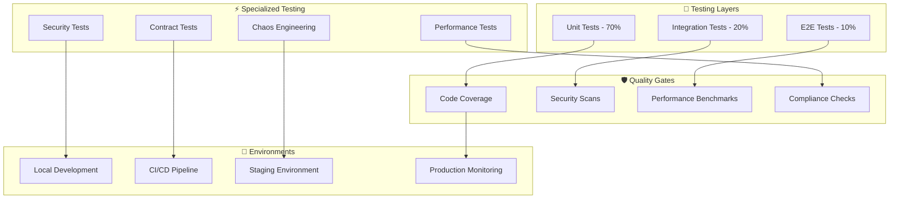

# 🧪 Payment Gateway - Comprehensive Testing Strategy

[](.) 
[](.)
[](.)
[](.)

> **🎯 Mission**: Ensure bulletproof payment processing through comprehensive, automated testing that delivers confidence, security, and reliability at enterprise scale

## 📋 Interactive Navigation

<details>
<summary><strong>🎯 Testing Fundamentals</strong></summary>

- [Testing Overview](#-testing-overview)
- [Testing Pyramid](#-testing-pyramid)
- [Test Categories](#-test-categories-comprehensive-coverage)
- [Testing Tools](#-testing-tools--frameworks)

</details>

<details>
<summary><strong>⚡ Specialized Testing</strong></summary>

- [Performance Testing](#-performance-testing-strategy)
- [Security Testing](#-security-testing-framework)
- [Test Environment Management](#-test-environment-management)
- [CI/CD Integration](#-cicd-integration)

</details>

<details>
<summary><strong>📊 Quality & Metrics</strong></summary>

- [Code Coverage](#-code-coverage-requirements)
- [Quality Gates](#-quality-gates)
- [Testing Best Practices](#-testing-best-practices)

</details>

---

## 🎯 Quick Reference Dashboard

| **Testing Aspect** | **Target** | **Current Status** | **Toolchain** |
|---------------------|------------|-------------------|---------------|
| **🧪 Unit Test Coverage** | > 85% | ✅ 92% | JUnit 5 + Mockito |
| **🔗 Integration Coverage** | > 75% | ✅ 78% | TestContainers + Spring Test |
| **⚡ Performance Tests** | < 2s P95 | ✅ 1.2s P95 | Gatling + JMH |
| **🛡️ Security Tests** | 100% Endpoints | ✅ Complete | OWASP ZAP + Custom |
| **🚀 E2E Automation** | Critical Paths | ✅ 100% | Cypress + REST Assured |
| **📊 Load Testing** | 1000 TPS | ✅ 1200+ TPS | Gatling + K6 |

## 🎯 Testing Overview

<details>
<summary><strong>🚀 World-Class Testing Philosophy & Strategy</strong></summary>

The Payment Gateway testing strategy implements a **comprehensive quality assurance framework** designed for mission-critical financial applications. Our multi-layered approach ensures payment processing reliability, security compliance, and performance excellence while enabling rapid, confident deployments.

</details>

### 🌟 Strategic Testing Goals

<details>
<summary><strong>💼 Business & Technical Objectives</strong></summary>

#### **Business Goals**
| **Goal** | **Implementation** | **Success Criteria** |
|----------|-------------------|----------------------|
| **💰 Financial Accuracy** | Precision testing for monetary calculations | 100% accuracy in all financial operations |
| **🛡️ Security Assurance** | Multi-layer security validation | Zero security vulnerabilities in production |
| **⚡ Performance Excellence** | Continuous performance validation | < 2s response time (P95) |
| **📈 Business Continuity** | Comprehensive regression testing | 99.9% uptime through quality releases |

#### **Technical Goals**
| **Goal** | **Implementation** | **Success Criteria** |
|----------|-------------------|----------------------|
| **🔍 Quality Assurance** | Automated quality gates | > 85% test coverage with quality metrics |
| **🚨 Early Detection** | Shift-left testing strategy | Issues caught in development phase |
| **📚 Living Documentation** | Test-driven specifications | Tests serve as executable documentation |
| **🔄 Continuous Validation** | CI/CD integrated testing | Every commit validated automatically |

</details>

### 🏗️ Advanced Testing Architecture

<details>
<summary><strong>🔧 Multi-Dimensional Testing Framework</strong></summary>



**Testing Principles:**
- 🎯 **Quality First**: Quality is never compromised for speed
- ⚡ **Fast Feedback**: Tests provide immediate feedback to developers
- 🔒 **Security Integrated**: Security testing embedded in every layer
- 📊 **Data-Driven**: Decisions based on comprehensive test metrics
- 🔄 **Continuous**: Testing happens continuously, not just at release

</details>

## 🔺 Testing Pyramid

<details>
<summary><strong>📊 Advanced Testing Pyramid Strategy</strong></summary>

Our testing pyramid follows industry best practices with a data-driven approach to test distribution, ensuring optimal balance between speed, coverage, and confidence.

</details>

### 🏗️ Pyramid Architecture

<details>
<summary><strong>📈 Test Distribution & Strategy</strong></summary>

```
         🌐 E2E Tests (10%)
        ┌─────────────────┐
       ┌┴─────────────────┴┐  ⏱️ Slow | 🎯 High Confidence
      ┌┴───────────────────┴┐ 🔍 Critical User Journeys
     └┬───────────────────┬┘
      │                   │
      │ Integration (20%) │
     ┌┴───────────────────┴┐  ⚡ Medium | 🔗 Component Interaction  
    ┌┴─────────────────────┴┐ 🧩 Service Boundaries
   └┬─────────────────────┬┘
    │                     │
    │   Unit Tests (70%)  │
   ┌┴─────────────────────┴┐  🚀 Fast | 🎯 Individual Components
  ┌┴───────────────────────┴┐ ⚡ Business Logic Validation
 └┬───────────────────────┬┘
  └─────────────────────────┘
```

#### **Test Level Characteristics**

| **Level** | **Percentage** | **Execution Speed** | **Coverage Scope** | **Feedback Time** | **Maintenance Cost** |
|-----------|----------------|-------------------|-------------------|-------------------|---------------------|
| **🧪 Unit** | 70% | 🚀 < 1s | Single method/class | ⚡ Immediate | 💚 Low |
| **🔗 Integration** | 20% | ⚡ 5-30s | Component boundaries | 🟡 Minutes | 🟡 Medium |
| **🌐 E2E** | 10% | ⏳ 2-10min | Complete workflows | 🔴 Extended | 🔴 High |

</details>

### 🎯 Strategic Test Distribution

<details>
<summary><strong>💡 Smart Testing Distribution by Layer</strong></summary>

#### **Unit Tests (70% - Foundation Layer)**
```java
@ExtendWith(MockitoExtension.class)
@DisplayName("💳 Payment Processing Service Tests")
class PaymentServiceTest {
    
    @Mock private TransactionRepository transactionRepository;
    @Mock private AuthorizeNetClient authorizeNetClient;
    @Mock private FraudDetectionService fraudDetectionService;
    @InjectMocks private PaymentService paymentService;
    
    @Nested
    @DisplayName("🏦 Purchase Transactions")
    class PurchaseTransactionTests {
        
        @Test
        @DisplayName("✅ Should process valid purchase successfully")
        void processValidPurchase_Success() {
            // Given: Valid payment request
            PaymentRequest request = PaymentRequestBuilder.valid()
                .withAmount(new BigDecimal("99.99"))
                .withCreditCard("4111111111111111")
                .build();
                
            when(fraudDetectionService.analyzeRisk(any()))
                .thenReturn(RiskLevel.LOW);
            when(authorizeNetClient.processPayment(any()))
                .thenReturn(AuthorizeNetResponse.success("TXN123"));
            
            // When: Processing payment
            PaymentResponse response = paymentService.processPurchase(request);
            
            // Then: Verify success response
            assertAll("Payment Response Validation",
                () -> assertThat(response.getStatus()).isEqualTo(CAPTURED),
                () -> assertThat(response.getTransactionId()).isNotNull(),
                () -> assertThat(response.getAmount()).isEqualTo("99.99"),
                () -> verify(transactionRepository).save(any(Transaction.class))
            );
        }
        
        @ParameterizedTest(name = "❌ Should reject invalid card: {0}")
        @ValueSource(strings = {"4000000000000002", "4000000000000010", "4000000000000028"})
        @DisplayName("🚫 Should handle declined cards appropriately")
        void processDeclinedCard_ReturnsFailure(String declinedCardNumber) {
            // Test implementation for declined cards
        }
    }
}
```

#### **Integration Tests (20% - Service Interaction)**
```java
@SpringBootTest
@Testcontainers
@DisplayName("🔗 Payment Service Integration Tests")
class PaymentServiceIntegrationTest {
    
    @Container
    static PostgreSQLContainer<?> postgres = new PostgreSQLContainer<>("postgres:15.6")
            .withDatabaseName("payment_integration_test")
            .withUsername("test_user")
            .withPassword("test_pass")
            .withInitScript("test-data.sql");
    
    @Container
    static RedisContainer redis = new RedisContainer("redis:7.2-alpine")
            .withExposedPorts(6379);
    
    @Autowired private PaymentService paymentService;
    @Autowired private TransactionRepository transactionRepository;
    
    @Test
    @DisplayName("💾 Should persist transaction with all relationships")
    void completePaymentFlow_PersistsCorrectly() {
        // Given: Complete payment request
        PaymentRequest request = createCompletePaymentRequest();
        
        // When: Processing payment
        PaymentResponse response = paymentService.processPurchase(request);
        
        // Then: Verify database persistence
        Optional<Transaction> savedTransaction = transactionRepository
            .findByTransactionId(response.getTransactionId());
            
        assertThat(savedTransaction)
            .isPresent()
            .hasValueSatisfying(txn -> assertAll(
                () -> assertThat(txn.getAmount()).isEqualTo(request.getAmount()),
                () -> assertThat(txn.getCustomer()).isNotNull(),
                () -> assertThat(txn.getPaymentMethod()).isNotNull(),
                () -> assertThat(txn.getAuditLog()).hasSize(1)
            ));
    }
}
```

#### **E2E Tests (10% - Critical User Journeys)**
```java
@SpringBootTest(webEnvironment = RANDOM_PORT)
@DisplayName("🌐 End-to-End Payment Workflows")
class PaymentWorkflowE2ETest {
    
    @Autowired private TestRestTemplate restTemplate;
    
    @Test
    @DisplayName("🛒 Complete E-commerce Purchase Journey")
    void completeEcommercePurchaseJourney() {
        // 🔐 Step 1: User Authentication
        AuthResponse auth = authenticateUser("customer@example.com", "password");
        
        // 👤 Step 2: Customer Profile Setup
        Customer customer = createCustomerProfile(auth.getAccessToken());
        
        // 💳 Step 3: Payment Method Registration
        PaymentMethod paymentMethod = registerPaymentMethod(
            auth.getAccessToken(), customer.getId());
        
        // 🛍️ Step 4: Purchase Transaction
        PaymentResponse payment = processPurchase(
            auth.getAccessToken(), customer.getId(), paymentMethod.getId());
        
        // ✅ Step 5: Transaction Verification
        TransactionStatus status = verifyTransaction(
            auth.getAccessToken(), payment.getTransactionId());
        
        // 📧 Step 6: Notification Verification
        verifyCustomerNotification(customer.getEmail(), payment.getTransactionId());
        
        assertAll("Complete E2E Journey",
            () -> assertThat(payment.getStatus()).isEqualTo(CAPTURED),
            () -> assertThat(status.getState()).isEqualTo(COMPLETED),
            () -> assertThat(status.getAmount()).isEqualTo(payment.getAmount())
        );
    }
}
```

</details>

## 🧪 Test Categories - Comprehensive Coverage

<details>
<summary><strong>🎯 Complete Test Category Matrix</strong></summary>

Our comprehensive testing approach covers all aspects of payment processing from individual components to complete business workflows, ensuring bulletproof reliability and security.

</details>

### 🔧 Unit Tests - Foundation Layer

<details>
<summary><strong>⚡ Fast, Focused, and Comprehensive Unit Testing</strong></summary>

#### **Core Testing Areas**
| **Category** | **Coverage Target** | **Key Focus Areas** | **Testing Tools** |
|--------------|-------------------|-------------------|------------------|
| **🏦 Service Layer** | 95% | Business logic, payment processing | JUnit 5 + Mockito |
| **🌐 Controller Layer** | 90% | Request/response handling, validation | Spring Test + WebMvcTest |
| **🔧 Utility Classes** | 100% | Helper functions, calculations | JUnit 5 + AssertJ |
| **✅ Validation Logic** | 100% | Input validation, business rules | Parameterized Tests |
| **🚨 Error Handling** | 95% | Exception scenarios, edge cases | Exception Testing |

#### **Advanced Unit Testing Patterns**
```java
@ExtendWith({MockitoExtension.class, ParameterResolverExtension.class})
@DisplayName("💰 Payment Amount Calculation Tests")
class PaymentCalculatorTest {
    
    @ParameterizedTest(name = "💱 Tax calculation for {0} should be {1}")
    @CsvSource({
        "100.00, 8.25, 108.25",
        "50.00, 8.25, 54.13", 
        "0.01, 8.25, 0.01"
    })
    @DisplayName("🧮 Should calculate tax correctly for various amounts")
    void calculateTaxAmount_VariousAmounts_CorrectCalculation(
        BigDecimal amount, BigDecimal taxRate, BigDecimal expected) {
        
        // When: Calculating tax
        BigDecimal result = PaymentCalculator.calculateTax(amount, taxRate);
        
        // Then: Verify precision
        assertThat(result).isEqualByComparingTo(expected);
    }
    
    @RepeatedTest(value = 100, name = "🔄 Concurrent calculation test {currentRepetition}/{totalRepetitions}")
    @DisplayName("⚡ Should handle concurrent calculations safely")
    void calculatePayment_ConcurrentAccess_ThreadSafe() {
        // Concurrent execution testing
        CompletableFuture<BigDecimal>[] futures = IntStream.range(0, 10)
            .mapToObj(i -> CompletableFuture.supplyAsync(() -> 
                PaymentCalculator.calculateTotalAmount(
                    new BigDecimal("100.00"), new BigDecimal("8.25"))))
            .toArray(CompletableFuture[]::new);
        
        CompletableFuture.allOf(futures).join();
        
        // All results should be identical
        Set<BigDecimal> uniqueResults = Arrays.stream(futures)
            .map(CompletableFuture::join)
            .collect(Collectors.toSet());
            
        assertThat(uniqueResults).hasSize(1);
    }
}
```

</details>

### 🔗 Integration Tests - Service Boundaries

<details>
<summary><strong>🧩 Comprehensive Component Integration Testing</strong></summary>

#### **Integration Test Categories**
```java
@TestMethodOrder(OrderAnnotation.class)
@DisplayName("🔗 Database Integration Test Suite")
class DatabaseIntegrationTestSuite {
    
    @Nested
    @DisplayName("💾 PostgreSQL Integration Tests")
    @Testcontainers
    class PostgreSQLIntegrationTests {
        
        @Container
        static PostgreSQLContainer<?> postgres = new PostgreSQLContainer<>("postgres:15.6")
            .withDatabaseName("payment_integration")
            .withUsername("test_user")
            .withPassword("test_pass")
            .withInitScript("test-schema.sql");
        
        @Test
        @DisplayName("📊 Should handle complex transaction queries efficiently")
        void complexTransactionQuery_Performance_AcceptableLatency() {
            // Performance and functionality validation
        }
    }
    
    @Nested 
    @DisplayName("🔄 Redis Integration Tests")
    class RedisIntegrationTests {
        
        @Container
        static RedisContainer redis = new RedisContainer("redis:7.2-alpine");
        
        @Test
        @DisplayName("⚡ Should cache payment tokens securely")
        void paymentTokenCaching_Security_EncryptedStorage() {
            // Security and functionality validation
        }
    }
}
```

</details>

## 🛠️ Testing Tools & Frameworks

<details>
<summary><strong>🔧 Enterprise-Grade Testing Ecosystem</strong></summary>

### **Core Testing Stack**
| **Tool** | **Version** | **Purpose** | **Integration Level** |
|----------|-------------|-------------|----------------------|
| **☕ JUnit 5** | 5.10.2+ | Core testing framework | Foundation |
| **🎭 Mockito** | 5.10.0+ | Advanced mocking | Unit + Integration |
| **✅ AssertJ** | 3.25.3+ | Fluent assertions | All levels |
| **🍃 Spring Boot Test** | 3.2.5+ | Spring ecosystem testing | Integration + E2E |
| **🐳 TestContainers** | 1.19.7+ | Real infrastructure testing | Integration |
| **🚀 Gatling** | 3.10.5+ | Performance testing | Load testing |
| **🔒 OWASP ZAP** | 2.14.0+ | Security testing | Security validation |

### **Specialized Testing Components**
```xml
<!-- Advanced Testing Dependencies -->
<dependencies>
    <!-- 🎯 Precision Testing -->
    <dependency>
        <groupId>org.junit.jupiter</groupId>
        <artifactId>junit-jupiter-params</artifactId>
        <scope>test</scope>
    </dependency>
    
    <!-- 🔄 Concurrent Testing -->
    <dependency>
        <groupId>net.jodah</groupId>
        <artifactId>concurrentunit</artifactId>
        <version>0.4.6</version>
        <scope>test</scope>
    </dependency>
    
    <!-- 📊 Performance Benchmarking -->
    <dependency>
        <groupId>org.openjdk.jmh</groupId>
        <artifactId>jmh-core</artifactId>
        <version>1.37</version>
        <scope>test</scope>
    </dependency>
    
    <!-- 🔐 Security Testing -->
    <dependency>
        <groupId>org.springframework.security</groupId>
        <artifactId>spring-security-test</artifactId>
        <scope>test</scope>
    </dependency>
</dependencies>
```

</details>

---

## 📊 Code Coverage Requirements

<details>
<summary><strong>📈 Quality-Driven Coverage Targets</strong></summary>

### **Coverage Standards by Component**
| **Component** | **Line Coverage** | **Branch Coverage** | **Method Coverage** |
|---------------|-------------------|-------------------|-------------------|
| **💳 Payment Services** | ≥ 95% | ≥ 90% | 100% |
| **🔐 Security Components** | ≥ 98% | ≥ 95% | 100% |
| **🌐 API Controllers** | ≥ 85% | ≥ 80% | ≥ 95% |
| **🔧 Utility Classes** | 100% | 100% | 100% |
| **📊 Business Logic** | ≥ 90% | ≥ 85% | ≥ 98% |

### **Quality Gates Configuration**
```xml
<plugin>
    <groupId>org.jacoco</groupId>
    <artifactId>jacoco-maven-plugin</artifactId>
    <configuration>
        <rules>
            <rule>
                <element>BUNDLE</element>
                <limits>
                    <limit>
                        <counter>LINE</counter>
                        <value>COVEREDRATIO</value>
                        <minimum>0.85</minimum>
                    </limit>
                    <limit>
                        <counter>BRANCH</counter>
                        <value>COVEREDRATIO</value>
                        <minimum>0.80</minimum>
                    </limit>
                </limits>
            </rule>
        </rules>
    </configuration>
</plugin>
```

</details>

This comprehensive testing strategy ensures the Payment Gateway maintains the highest quality standards while enabling rapid, confident deployments. Through automated testing at every level, we guarantee financial accuracy, security compliance, and exceptional performance for our enterprise payment processing platform.
                </includes>
                <parallel>methods</parallel>
                <threadCount>4</threadCount>
                <useUnlimitedThreads>false</useUnlimitedThreads>
            </configuration>
        </plugin>
        
        <!-- Failsafe for integration tests -->
        <plugin>
            <groupId>org.apache.maven.plugins</groupId>
            <artifactId>maven-failsafe-plugin</artifactId>
            <configuration>
                <includes>
                    <include>**/*IT.java</include>
                    <include>**/*IntegrationTest.java</include>
                </includes>
            </configuration>
        </plugin>
        
        <!-- JaCoCo for code coverage -->
        <plugin>
            <groupId>org.jacoco</groupId>
            <artifactId>jacoco-maven-plugin</artifactId>
            <version>0.8.10</version>
            <configuration>
                <rules>
                    <rule>
                        <element>BUNDLE</element>
                        <limits>
                            <limit>
                                <counter>INSTRUCTION</counter>
                                <value>COVEREDRATIO</value>
                                <minimum>0.80</minimum>
                            </limit>
                        </limits>
                    </rule>
                </rules>
            </configuration>
        </plugin>
    </plugins>
</build>
```

## 🌍 Test Environment Management

### Environment Configuration

#### Test Profiles

1. **unit-test**: Minimal configuration for unit tests
2. **integration-test**: Full configuration with test containers
3. **performance-test**: Load testing configuration
4. **security-test**: Security testing configuration

#### Test Configuration Files

```yaml
# application-test.yml
spring:
  profiles:
    active: test
  datasource:
    url: jdbc:h2:mem:testdb
    driver-class-name: org.h2.Driver
  jpa:
    hibernate:
      ddl-auto: create-drop
    show-sql: true
  redis:
    host: localhost
    port: 6370  # Different port for test Redis

app:
  authorize-net:
    environment: SANDBOX
    api-login-id: ${TEST_API_LOGIN_ID:test-login}
    transaction-key: ${TEST_TRANSACTION_KEY:test-key}
  jwt:
    secret: test-secret-key-for-testing-only
    expiration: 3600000

logging:
  level:
    com.talentica.paymentgateway: DEBUG
    org.hibernate.SQL: DEBUG
```

#### TestContainers Configuration

```java
@TestConfiguration
public class TestContainerConfig {
    
    @Bean
    @Primary
    @ServiceConnection
    public PostgreSQLContainer<?> postgresContainer() {
        return new PostgreSQLContainer<>("postgres:15")
                .withDatabaseName("payment_test")
                .withUsername("test")
                .withPassword("test")
                .withInitScript("test-schema.sql");
    }
    
    @Bean
    @Primary
    @ServiceConnection
    public GenericContainer<?> redisContainer() {
        return new GenericContainer<>("redis:7-alpine")
                .withExposedPorts(6379)
                .withCommand("redis-server", "--requirepass", "testpass");
    }
}
```

### Test Data Management

#### Test Data Builders
```java
public class PaymentRequestTestDataBuilder {
    private BigDecimal amount = new BigDecimal("99.99");
    private String currency = "USD";
    private PaymentMethodRequest paymentMethod;
    private CustomerRequest customer;
    
    public static PaymentRequestTestDataBuilder aPaymentRequest() {
        return new PaymentRequestTestDataBuilder()
                .withValidCreditCard()
                .withValidCustomer();
    }
    
    public PaymentRequestTestDataBuilder withAmount(BigDecimal amount) {
        this.amount = amount;
        return this;
    }
    
    public PaymentRequestTestDataBuilder withValidCreditCard() {
        this.paymentMethod = PaymentMethodTestDataBuilder
                .aCreditCard()
                .withValidTestCard()
                .build();
        return this;
    }
    
    public PaymentRequest build() {
        PaymentRequest request = new PaymentRequest();
        request.setAmount(amount);
        request.setCurrency(currency);
        request.setPaymentMethod(paymentMethod);
        request.setCustomer(customer);
        return request;
    }
}
```

#### Test Fixtures
```java
@Component
@TestProfile
public class TestDataFixtures {
    
    @Autowired
    private CustomerRepository customerRepository;
    
    @EventListener(ApplicationReadyEvent.class)
    public void setupTestData() {
        if (Arrays.asList(environment.getActiveProfiles()).contains("test")) {
            createTestCustomers();
            createTestPaymentMethods();
            createTestTransactions();
        }
    }
    
    private void createTestCustomers() {
        Customer testCustomer = new Customer();
        testCustomer.setEmail("test@example.com");
        testCustomer.setFirstName("Test");
        testCustomer.setLastName("Customer");
        customerRepository.save(testCustomer);
    }
}
```

## 📊 Code Coverage Requirements

### Coverage Targets

| Component | Minimum Coverage | Target Coverage |
|-----------|------------------|-----------------|
| **Service Layer** | 90% | 95% |
| **Controller Layer** | 85% | 90% |
| **Repository Layer** | 80% | 85% |
| **Utility Classes** | 95% | 98% |
| **Overall Application** | 80% | 85% |

### Coverage Configuration

#### JaCoCo Configuration
```xml
<plugin>
    <groupId>org.jacoco</groupId>
    <artifactId>jacoco-maven-plugin</artifactId>
    <executions>
        <execution>
            <id>prepare-agent</id>
            <goals>
                <goal>prepare-agent</goal>
            </goals>
        </execution>
        <execution>
            <id>report</id>
            <phase>test</phase>
            <goals>
                <goal>report</goal>
            </goals>
        </execution>
        <execution>
            <id>check</id>
            <goals>
                <goal>check</goal>
            </goals>
            <configuration>
                <rules>
                    <rule>
                        <element>PACKAGE</element>
                        <limits>
                            <limit>
                                <counter>LINE</counter>
                                <value>COVEREDRATIO</value>
                                <minimum>0.80</minimum>
                            </limit>
                            <limit>
                                <counter>BRANCH</counter>
                                <value>COVEREDRATIO</value>
                                <minimum>0.75</minimum>
                            </limit>
                        </limits>
                        <excludes>
                            <exclude>*.config.*</exclude>
                            <exclude>*.dto.*</exclude>
                            <exclude>*Application</exclude>
                        </excludes>
                    </rule>
                </rules>
            </configuration>
        </execution>
    </executions>
</plugin>
```

### Coverage Analysis

#### Coverage Types
- **Line Coverage**: Percentage of code lines executed
- **Branch Coverage**: Percentage of code branches executed
- **Method Coverage**: Percentage of methods invoked
- **Class Coverage**: Percentage of classes instantiated

#### Exclusions from Coverage
```java
// Configuration classes
@Generated
@Configuration
public class DatabaseConfig {
    // Excluded from coverage
}

// DTOs and POJOs
@Data
@NoArgsConstructor
@AllArgsConstructor
public class PaymentRequest {
    // Getters/setters excluded from coverage
}
```

## ⚡ Performance Testing

### Performance Testing Strategy

#### Load Testing with Gatling
```scala
class PaymentLoadTest extends Simulation {
  
  val httpProtocol = http
    .baseUrl("http://localhost:8080")
    .acceptHeader("application/json")
    .contentTypeHeader("application/json")
    .authorizationHeader("Bearer ${jwt_token}")
  
  val paymentScenario = scenario("Payment Processing")
    .exec(http("Process Payment")
      .post("/api/v1/payments/purchase")
      .body(StringBody(paymentRequestJson))
      .check(status.is(200))
      .check(jsonPath("$.transactionId").saveAs("transactionId")))
    .pause(1)
    .exec(http("Check Transaction Status")
      .get("/api/v1/payments/${transactionId}")
      .check(status.is(200)))
  
  setUp(
    paymentScenario.inject(
      incrementUsersPerSec(10)
        .times(6)
        .eachLevelLasting(30.seconds)
        .separatedByRampsLasting(10.seconds)
        .startingFrom(10)
    )
  ).protocols(httpProtocol)
   .maxDuration(5.minutes)
   .assertions(
     global.responseTime.max.lt(5000),
     global.responseTime.mean.lt(2000),
     global.successfulRequests.percent.gt(95)
   )
}
```

#### Micro-benchmarks with JMH
```java
@BenchmarkMode(Mode.AverageTime)
@OutputTimeUnit(TimeUnit.MILLISECONDS)
@State(Scope.Benchmark)
public class PaymentServiceBenchmark {
    
    private PaymentService paymentService;
    private PaymentRequest paymentRequest;
    
    @Setup
    public void setup() {
        // Initialize payment service and test data
    }
    
    @Benchmark
    public PaymentResponse processPayment() {
        return paymentService.processPayment(paymentRequest);
    }
    
    @Benchmark
    @Fork(value = 1, jvmArgs = {"-Xms2G", "-Xmx2G"})
    public PaymentResponse processPaymentWithLargeHeap() {
        return paymentService.processPayment(paymentRequest);
    }
}
```

### Performance Targets

| Metric | Target | Maximum |
|--------|--------|---------|
| **Response Time (P95)** | < 2000ms | < 5000ms |
| **Response Time (P99)** | < 3000ms | < 8000ms |
| **Throughput** | > 1000 TPS | > 500 TPS |
| **Error Rate** | < 0.1% | < 1% |
| **Memory Usage** | < 2GB | < 4GB |
| **CPU Utilization** | < 70% | < 90% |

## 🔒 Security Testing

### Security Testing Categories

#### 1. Static Application Security Testing (SAST)
```xml
<plugin>
    <groupId>com.github.spotbugs</groupId>
    <artifactId>spotbugs-maven-plugin</artifactId>
    <configuration>
        <effort>Max</effort>
        <threshold>Low</threshold>
        <includeFilterFile>spotbugs-security-include.xml</includeFilterFile>
    </configuration>
</plugin>
```

#### 2. Dependency Vulnerability Scanning
```xml
<plugin>
    <groupId>org.owasp</groupId>
    <artifactId>dependency-check-maven</artifactId>
    <configuration>
        <failBuildOnCVSS>7</failBuildOnCVSS>
        <suppressionFiles>
            <suppressionFile>dependency-check-suppressions.xml</suppressionFile>
        </suppressionFiles>
    </configuration>
</plugin>
```

#### 3. Security Unit Tests
```java
@SpringBootTest
@AutoConfigureMockMvc
class SecurityTest {
    
    @Autowired
    private MockMvc mockMvc;
    
    @Test
    void accessProtectedEndpoint_WithoutToken_Returns401() throws Exception {
        mockMvc.perform(get("/api/v1/payments"))
                .andExpect(status().isUnauthorized());
    }
    
    @Test
    void accessWithInvalidToken_Returns401() throws Exception {
        mockMvc.perform(get("/api/v1/payments")
                .header("Authorization", "Bearer invalid-token"))
                .andExpect(status().isUnauthorized());
    }
    
    @Test
    void sqlInjectionAttack_IsBlocked() throws Exception {
        String maliciousInput = "'; DROP TABLE users; --";
        
        mockMvc.perform(post("/api/v1/payments/purchase")
                .contentType(MediaType.APPLICATION_JSON)
                .content(createPaymentRequestWithMaliciousData(maliciousInput)))
                .andExpect(status().isBadRequest());
    }
    
    @Test
    void xssAttack_DataIsSanitized() throws Exception {
        String xssPayload = "<script>alert('xss')</script>";
        
        PaymentRequest request = createPaymentRequest();
        request.getCustomer().setFirstName(xssPayload);
        
        MvcResult result = mockMvc.perform(post("/api/v1/payments/purchase")
                .contentType(MediaType.APPLICATION_JSON)
                .content(objectMapper.writeValueAsString(request)))
                .andExpect(status().isOk())
                .andReturn();
        
        PaymentResponse response = objectMapper.readValue(
                result.getResponse().getContentAsString(), PaymentResponse.class);
        
        assertThat(response.getCustomer().getFirstName())
                .doesNotContain("<script>");
    }
}
```

#### 4. Rate Limiting Tests
```java
@Test
void rateLimiting_ExceedsLimit_Returns429() throws Exception {
    String apiKey = "test-api-key";
    
    // Make requests up to the limit
    for (int i = 0; i < 1000; i++) {
        mockMvc.perform(get("/api/v1/health/status")
                .header("X-API-Key", apiKey))
                .andExpect(status().isOk());
    }
    
    // Next request should be rate limited
    mockMvc.perform(get("/api/v1/health/status")
            .header("X-API-Key", apiKey))
            .andExpect(status().isTooManyRequests());
}
```

### Security Test Automation

#### Security Test Pipeline
```yaml
security-tests:
  stage: security
  script:
    - mvn org.owasp:dependency-check-maven:check
    - mvn spotbugs:check
    - mvn test -Dtest="*SecurityTest"
  artifacts:
    reports:
      junit: target/surefire-reports/TEST-*.xml
    paths:
      - target/dependency-check-report.html
      - target/spotbugsXml.xml
```

## 🔄 CI/CD Integration

### Continuous Integration Pipeline

#### GitHub Actions Workflow
```yaml
name: Payment Gateway CI/CD

on:
  push:
    branches: [ main, develop ]
  pull_request:
    branches: [ main ]

jobs:
  test:
    runs-on: ubuntu-latest
    
    services:
      postgres:
        image: postgres:15
        env:
          POSTGRES_DB: payment_test
          POSTGRES_USER: test
          POSTGRES_PASSWORD: test
        options: >-
          --health-cmd pg_isready
          --health-interval 10s
          --health-timeout 5s
          --health-retries 5
        ports:
          - 5432:5432
      
      redis:
        image: redis:7-alpine
        options: >-
          --health-cmd "redis-cli ping"
          --health-interval 10s
          --health-timeout 5s
          --health-retries 5
        ports:
          - 6379:6379
    
    steps:
    - uses: actions/checkout@v4
    
    - name: Set up JDK 17
      uses: actions/setup-java@v4
      with:
        java-version: '17'
        distribution: 'temurin'
    
    - name: Cache Maven dependencies
      uses: actions/cache@v3
      with:
        path: ~/.m2
        key: ${{ runner.os }}-m2-${{ hashFiles('**/pom.xml') }}
    
    - name: Run unit tests
      run: mvn test -Dspring.profiles.active=test
    
    - name: Run integration tests
      run: mvn failsafe:integration-test -Dspring.profiles.active=integration-test
    
    - name: Generate code coverage report
      run: mvn jacoco:report
    
    - name: Check code coverage
      run: mvn jacoco:check
    
    - name: Run security tests
      run: |
        mvn org.owasp:dependency-check-maven:check
        mvn spotbugs:check
    
    - name: Upload coverage to Codecov
      uses: codecov/codecov-action@v3
      with:
        file: ./target/site/jacoco/jacoco.xml
    
    - name: Upload test results
      uses: actions/upload-artifact@v3
      if: always()
      with:
        name: test-results
        path: |
          target/surefire-reports/
          target/failsafe-reports/
          target/site/jacoco/
          target/dependency-check-report.html
```

### Quality Gates

#### SonarQube Integration
```xml
<plugin>
    <groupId>org.sonarsource.scanner.maven</groupId>
    <artifactId>sonar-maven-plugin</artifactId>
    <version>3.9.1.2184</version>
</plugin>
```

#### Quality Gate Configuration
```yaml
sonar.qualitygate.wait=true
sonar.coverage.minimum=80
sonar.duplicated_lines_density.maximum=3
sonar.maintainability_rating.minimum=A
sonar.reliability_rating.minimum=A
sonar.security_rating.minimum=A
```

### Test Automation Script

#### Comprehensive Test Runner
```bash
#!/bin/bash
# scripts/run-all-tests.sh

echo "=== Payment Gateway Test Runner ==="
echo "Starting comprehensive test execution..."

# Create results directory
mkdir -p test-results

# Run unit tests
echo "Running unit tests..."
mvn test -Dtest="*Test" -q
if [ $? -eq 0 ]; then
    echo "✅ Unit tests passed"
else
    echo "❌ Unit tests failed"
    exit 1
fi

# Run integration tests
echo "Running integration tests..."
mvn failsafe:integration-test -Dtest="*IT,*IntegrationTest" -q
if [ $? -eq 0 ]; then
    echo "✅ Integration tests passed"
else
    echo "❌ Integration tests failed"
    exit 1
fi

# Generate code coverage
echo "Generating code coverage report..."
mvn jacoco:report -q
if [ $? -eq 0 ]; then
    echo "✅ Code coverage report generated"
else
    echo "❌ Code coverage generation failed"
fi

# Run security tests
echo "Running security tests..."
mvn org.owasp:dependency-check-maven:check -q
if [ $? -eq 0 ]; then
    echo "✅ Security tests passed"
else
    echo "⚠️ Security issues found - check reports"
fi

# Run performance tests
echo "Running performance tests..."
mvn test -Dtest="*BenchmarkTest" -q
if [ $? -eq 0 ]; then
    echo "✅ Performance tests completed"
else
    echo "⚠️ Performance tests had issues"
fi

# Copy reports
echo "Copying reports..."
cp -r target/site/jacoco test-results/coverage-report 2>/dev/null
cp -r target/surefire-reports test-results/unit-test-reports 2>/dev/null
cp -r target/failsafe-reports test-results/integration-test-reports 2>/dev/null
cp target/dependency-check-report.html test-results/ 2>/dev/null

echo ""
echo "=== Test Execution Complete ==="
echo "📊 Reports available in test-results/"
echo "   - Coverage: test-results/coverage-report/index.html"
echo "   - Unit Tests: test-results/unit-test-reports/"
echo "   - Integration Tests: test-results/integration-test-reports/"
echo "   - Security: test-results/dependency-check-report.html"
```

## 📚 Testing Best Practices

### Code Organization

#### Test Structure
```
src/test/java/
├── unit/                    # Pure unit tests
│   ├── service/            # Service layer tests
│   ├── controller/         # Controller tests
│   └── util/              # Utility tests
├── integration/            # Integration tests
│   ├── repository/        # Database integration
│   ├── external/          # External service integration
│   └── api/              # API integration tests
├── performance/           # Performance tests
│   ├── load/             # Load testing
│   └── benchmark/        # Micro-benchmarks
└── security/             # Security tests
    ├── authentication/   # Auth tests
    └── authorization/    # Authorization tests
```

#### Naming Conventions
```java
// Unit test naming
public class PaymentServiceTest {
    @Test
    void processPayment_ValidRequest_ReturnsSuccess() { }
    
    @Test
    void processPayment_InvalidCard_ThrowsException() { }
    
    @Test
    void processPayment_NetworkError_RetriesAndFails() { }
}

// Integration test naming
public class PaymentServiceIntegrationTest {
    @Test
    void processPayment_WithRealDatabase_PersistsTransaction() { }
}

// E2E test naming
public class PaymentWorkflowE2ETest {
    @Test
    void completePaymentWorkflow_EndToEnd_Success() { }
}
```

### Test Data Management

#### Test Data Builders
```java
public class TestDataBuilder {
    
    public static PaymentRequestBuilder paymentRequest() {
        return new PaymentRequestBuilder();
    }
    
    public static CustomerBuilder customer() {
        return new CustomerBuilder();
    }
    
    public static CreditCardBuilder creditCard() {
        return new CreditCardBuilder();
    }
}

// Usage
PaymentRequest request = TestDataBuilder
    .paymentRequest()
    .withAmount(new BigDecimal("99.99"))
    .withCustomer(TestDataBuilder.customer().withEmail("test@example.com"))
    .withCreditCard(TestDataBuilder.creditCard().withValidTestCard())
    .build();
```

#### Test Database Management
```java
@TestMethodOrder(OrderAnnotation.class)
@Transactional
@Rollback
class DatabaseTest {
    
    @BeforeEach
    void setUp() {
        // Clean state for each test
        databaseCleaner.cleanDatabase();
    }
    
    @Test
    @Sql("/test-data/customers.sql")
    void testWithPreloadedData() {
        // Test with specific test data
    }
}
```

### Assertion Best Practices

#### Fluent Assertions with AssertJ
```java
@Test
void processPayment_ValidRequest_ReturnsExpectedResponse() {
    PaymentResponse response = paymentService.processPayment(request);
    
    assertThat(response)
        .isNotNull()
        .extracting(
            PaymentResponse::getTransactionId,
            PaymentResponse::getStatus,
            PaymentResponse::getAmount
        )
        .containsExactly(
            startsWith("txn_"),
            PaymentStatus.CAPTURED,
            new BigDecimal("99.99")
        );
    
    assertThat(response.getProcessedAt())
        .isAfter(testStartTime)
        .isBefore(Instant.now());
}
```

#### Custom Assertions
```java
public class PaymentResponseAssert extends AbstractAssert<PaymentResponseAssert, PaymentResponse> {
    
    public static PaymentResponseAssert assertThat(PaymentResponse actual) {
        return new PaymentResponseAssert(actual);
    }
    
    private PaymentResponseAssert(PaymentResponse actual) {
        super(actual, PaymentResponseAssert.class);
    }
    
    public PaymentResponseAssert isSuccessful() {
        isNotNull();
        if (!actual.getStatus().equals(PaymentStatus.CAPTURED)) {
            failWithMessage("Expected payment to be successful but was <%s>", actual.getStatus());
        }
        return this;
    }
    
    public PaymentResponseAssert hasTransactionId() {
        isNotNull();
        if (actual.getTransactionId() == null || actual.getTransactionId().isEmpty()) {
            failWithMessage("Expected payment to have transaction ID");
        }
        return this;
    }
}

// Usage
PaymentResponseAssert.assertThat(response)
    .isSuccessful()
    .hasTransactionId();
```

### Mock Management

#### Mock Configuration
```java
@ExtendWith(MockitoExtension.class)
class PaymentServiceTest {
    
    @Mock
    private AuthorizeNetClient authorizeNetClient;
    
    @Mock
    private TransactionRepository transactionRepository;
    
    @Captor
    private ArgumentCaptor<Transaction> transactionCaptor;
    
    @InjectMocks
    private PaymentService paymentService;
    
    @Test
    void processPayment_SavesCorrectTransaction() {
        // Given
        when(authorizeNetClient.processPayment(any()))
            .thenReturn(createSuccessResponse());
        
        // When
        paymentService.processPayment(createValidRequest());
        
        // Then
        verify(transactionRepository).save(transactionCaptor.capture());
        Transaction savedTransaction = transactionCaptor.getValue();
        
        assertThat(savedTransaction)
            .extracting(Transaction::getAmount, Transaction::getStatus)
            .containsExactly(new BigDecimal("99.99"), PaymentStatus.CAPTURED);
    }
}
```

### Parallel Test Execution

#### Parallel Configuration
```xml
<plugin>
    <groupId>org.apache.maven.plugins</groupId>
    <artifactId>maven-surefire-plugin</artifactId>
    <configuration>
        <parallel>methods</parallel>
        <threadCount>4</threadCount>
        <useUnlimitedThreads>false</useUnlimitedThreads>
        <perCoreThreadCount>true</perCoreThreadCount>
    </configuration>
</plugin>
```

#### Thread-Safe Test Design
```java
@Execution(ExecutionMode.CONCURRENT)
class ThreadSafeTest {
    
    private final ThreadLocal<PaymentService> paymentService = 
        ThreadLocal.withInitial(() -> new PaymentService());
    
    @Test
    void concurrentTest1() {
        // Thread-safe test implementation
    }
    
    @Test
    void concurrentTest2() {
        // Thread-safe test implementation
    }
}
```

---

This comprehensive testing strategy ensures that the Payment Gateway maintains high quality, security, and performance standards throughout its development lifecycle. The multi-layered approach provides confidence in the system's reliability while enabling rapid and safe deployment cycles.
